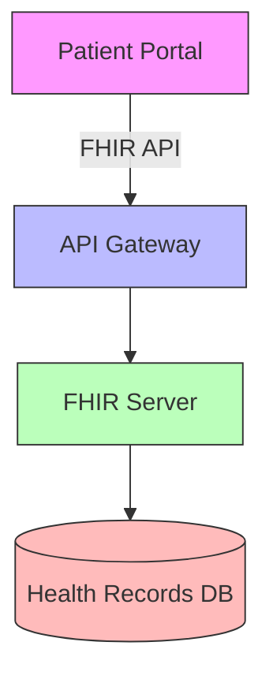

<!--
Definition of this template:

- Technical Requirements define the technical specifications and constraints of the system.
- They cover system architecture, technology stack, integration points, and technical constraints.
- These requirements guide the technical implementation and infrastructure decisions.

Instructions for this template:

- Copy and rename this file when creating new technical requirements.
- Replace all placeholders within square brackets [] with specific content.
- Examples are provided within the placeholders for guidance.
- Remove any instructional comments from the final document.
- Fields marked with **(Required)** are mandatory.

Metadata Tags (for AI tools and searchability):

- DocumentType: TechnicalRequirement
-->

# Technical Requirements Specification

## Table of Contents

<!--
Example:
- [TR-01: System Architecture](#tr-01)
- [TR-02: Database Design](#tr-02)
-->

---

### TR-[number] **(Required)**

#### Metadata

| Field | Value |
|-------|-------|
| **Title (Required)** | [Title, e.g., "FHIR Server Integration Architecture"] |
| **Category** | [Category, e.g., "System Integration"] |
| **Priority (Required)** | [Priority, e.g., "High"] |
| **Status** | [Current status, e.g., "In Review"] |

#### Overview **(Required)**

> [Brief description, e.g., "This technical requirement specifies the integration architecture between our Patient Portal and the FHIR R4 server, ensuring secure and efficient health data exchange."]

#### Architecture Diagram **(Required)**



#### Technology Stack **(Required)**

| Component | Technology | Version | Notes |
|-----------|------------|---------|--------|
| Frontend | [Tech, e.g., "React + Mantine"] | [Ver, e.g., "18.x"] | [Note, e.g., "For responsive UI"] |
| Backend | [Tech, e.g., "Next.js"] | [Ver, e.g., "14.x"] | [Note, e.g., "Server components"] |
| Database | [Tech, e.g., "PostgreSQL"] | [Ver, e.g., "15.x"] | [Note, e.g., "Primary storage"] |
| API | [Tech, e.g., "FHIR R4"] | [Ver, e.g., "4.0.1"] | [Note, e.g., "Health data standard"] |

#### Technical Requirements **(Required)**

1. **API Requirements**
   ```json
   {
     "protocol": "HTTPS/REST",
     "authentication": "OAuth 2.0",
     "dataFormat": "FHIR R4 JSON",
     "endpoints": [
       "/Patient",
       "/Observation",
       "/Condition"
     ]
   }
   ```

2. **Performance Requirements**
   - Response Time: [Metric, e.g., "< 500ms for 95% of requests"]
   - Throughput: [Metric, e.g., "100 requests/second"]
   - Availability: [Metric, e.g., "99.9% uptime"]

3. **Security Requirements**
   - Authentication: [Method, e.g., "JWT with OAuth 2.0"]
   - Encryption: [Standard, e.g., "TLS 1.3 for transit"]
   - Access Control: [Method, e.g., "RBAC with custom policies"]

#### Implementation Details

1. **Data Flow**
   ```mermaid
   sequenceDiagram
       Patient Portal->>API Gateway: Request
       API Gateway->>Auth Service: Validate
       Auth Service->>API Gateway: Token
       API Gateway->>FHIR Server: FHIR Request
       FHIR Server->>API Gateway: FHIR Response
       API Gateway->>Patient Portal: Response
   ```

2. **Error Handling**
   | Error Type | HTTP Code | Action |
   |------------|-----------|---------|
   | [Type, e.g., "Auth Failed"] | [Code, e.g., "401"] | [Action, e.g., "Redirect to login"] |
   | [Type, e.g., "Not Found"] | [Code, e.g., "404"] | [Action, e.g., "Show error message"] |

#### Dependencies **(Required)**

1. **External Systems**
   - [System, e.g., "MedPlum FHIR Server"]
   - [System, e.g., "Auth0 Identity Provider"]

2. **Internal Components**
   - [Component, e.g., "User Management Service"]
   - [Component, e.g., "Audit Logging System"]

#### Deployment Requirements

```yaml
deployment:
  environment:
    production:
      region: "us-east-1"
      scaling:
        min: 2
        max: 5
      resources:
        cpu: "2 vCPU"
        memory: "4 GB"
```

#### Monitoring and Logging

1. **Metrics to Track**
   - [Metric, e.g., "API response times"]
   - [Metric, e.g., "Error rates by endpoint"]

2. **Logging Requirements**
   - [Requirement, e.g., "HIPAA-compliant audit logs"]
   - [Requirement, e.g., "Request tracing"]

#### Testing Requirements

| Test Type | Tool | Coverage |
|-----------|------|----------|
| [Type, e.g., "Unit"] | [Tool, e.g., "Jest"] | [Coverage, e.g., "90%"] |
| [Type, e.g., "Integration"] | [Tool, e.g., "Cypress"] | [Coverage, e.g., "85%"] |

#### Compliance and Standards **(Required)**

- **Healthcare Standards**:
  - [Standard, e.g., "HIPAA Security Rule"]
  - [Standard, e.g., "HITECH Act"]

- **Technical Standards**:
  - [Standard, e.g., "FHIR R4 Compliance"]
  - [Standard, e.g., "OAuth 2.0 Standards"]

---

**Final Reminders:**

- Ensure all technical specifications are clear and measurable
- Include all necessary diagrams and architecture details
- Verify compatibility between components
- Remove template instructions before finalizing

---

export const metadata = {
  title: 'Technical Requirements Template',
  description: 'Template for documenting technical requirements and specifications',
  lastUpdated: new Date().toISOString()
};