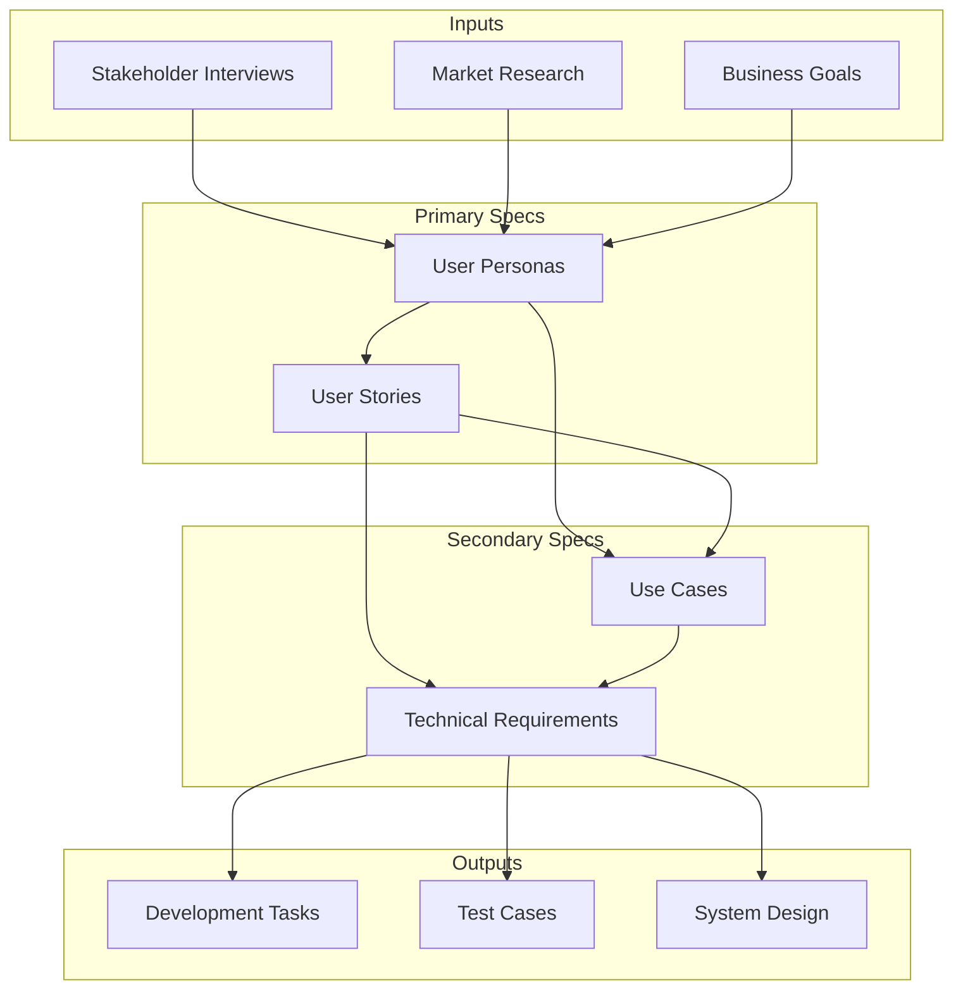
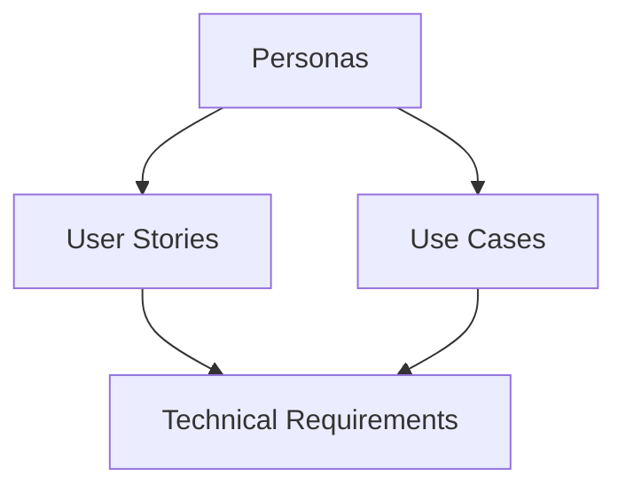

# Project Specifications Guide

## Overview
This directory contains all project specifications following Agile methodology. Each specification type has specific inputs required for creation and produces outputs used by other specification types.

## Specification Types and Relationships

### 1. User Personas (Primary)
**Required Inputs:**
- Stakeholder interviews
- Market research
- User surveys/feedback
- Business goals and objectives
- Domain expertise
- Competitor analysis

**Produces Outputs For:**
- User Stories (as user roles)
- Use Cases (as actors)
- UI/UX Design decisions
- Feature prioritization
- Marketing strategies

**Key Components:**
- User characteristics and behaviors
- Goals and pain points
- Usage patterns and preferences

**ID Format:** `PER-XXX-descriptor`

### 2. User Stories (Primary)
**Required Inputs:**
- User Personas (for roles)
- Business requirements
- Stakeholder needs
- Product vision
- Market opportunities
- User feedback

**Produces Outputs For:**
- Use Cases (as scenarios)
- Technical Requirements
- Sprint planning
- Feature development
- Test cases

**Key Components:**
- User role (references Persona)
- Desired action
- Expected benefit

**ID Format:** `US-XXX-descriptor`

### 3. Use Cases (Secondary)
**Required Inputs:**
- User Personas (as actors)
- User Stories (as features)
- Business rules
- System constraints
- Process flows
- Exception scenarios

**Produces Outputs For:**
- Technical Requirements
- Test scenarios
- UI workflows
- System design
- Documentation

**Key Components:**
- Actors (mapped from Personas)
- Preconditions and triggers
- Main and alternative flows

**ID Format:** `UC-XXX-descriptor`

### 4. Technical Requirements (Secondary)
**Required Inputs:**
- User Stories
- Use Cases
- System constraints
- Technical limitations
- Performance requirements
- Security standards
- Compliance needs

**Produces Outputs For:**
- Architecture design
- System implementation
- Testing strategy
- Infrastructure planning
- Security measures

**Key Components:**
- Functional requirements
- Non-functional requirements
- Technical constraints

**ID Format:** `TR-XXX-descriptor`

## Specification Creation Workflow

## Documentation Dependencies

### Creation Order and Dependencies
1. **User Personas**
   - Created first
   - Independent of other specifications
   - Foundation for all user-centric documentation

2. **User Stories**
   - Requires: User Personas
   - References: Business goals
   - Drives: Feature development

3. **Use Cases**
   - Requires: User Personas, User Stories
   - References: Business rules
   - Drives: Detailed implementation

4. **Technical Requirements**
   - Requires: User Stories, Use Cases
   - References: System constraints
   - Drives: Implementation details

## Cross-Reference Guidelines

### Linking Specifications
1. **In User Stories:**
   - Must reference: Related Persona(s)
   - May reference: Other User Stories
   - ID Format: `US-XXX references PER-YYY`

2. **In Use Cases:**
   - Must reference: Actor (Persona)
   - Must reference: Related User Stories
   - ID Format: `UC-XXX implements US-YYY using PER-ZZZ`

3. **In Technical Requirements:**
   - Must reference: User Stories/Use Cases
   - May reference: Other Technical Requirements
   - ID Format: `TR-XXX implements {US-YYY|UC-ZZZ}`

## Quality Checklist

### For Each Specification Type
1. **User Personas**
   - [ ] Based on real data/research
   - [ ] Covers all user types
   - [ ] Includes behavioral patterns

2. **User Stories**
   - [ ] References valid Persona
   - [ ] Clear business value
   - [ ] Testable outcome

3. **Use Cases**
   - [ ] Valid actor mapping
   - [ ] Complete flow description
   - [ ] Exception handling

4. **Technical Requirements**
   - [ ] Linked to user needs
   - [ ] Technically feasible
   - [ ] Measurable criteria

## Terminology Mapping

| Agile Term | Related Terms | Used In |
|------------|---------------|----------|
| Persona | Actor, User Role | Personas, Use Cases |
| User Story | Feature, Requirement | User Stories |
| Use Case | Scenario, Flow | Use Cases |
| Technical Requirement | System Requirement | Technical Specs |

## Template Usage

1. All specifications must use templates from `/08-Resources/01-Templates/`
2. Templates ensure consistency and completeness
3. Follow the naming conventions for each specification type

## Relationships and Traceability

## Quality Guidelines

1. **Completeness**
   - All required sections filled
   - All relationships documented
   - All dependencies identified

2. **Clarity**
   - Clear and concise language
   - Avoid technical jargon in user-facing specs
   - Include examples where helpful

3. **Consistency**
   - Use consistent terminology
   - Follow template structures
   - Maintain relationship integrity

## Version Control

- Use semantic versioning (X.Y.Z)
- Document changes in version history
- Keep specifications aligned with code versions

## Review Process

1. **Initial Draft**
   - Create using appropriate template
   - Fill all required sections
   - Verify relationships

2. **Peer Review**
   - Check completeness
   - Verify relationships
   - Validate against guidelines

3. **Stakeholder Review**
   - Validate business value
   - Confirm priorities
   - Approve final version

## Version
Last Updated: [Current Date]
Version: 1.0
