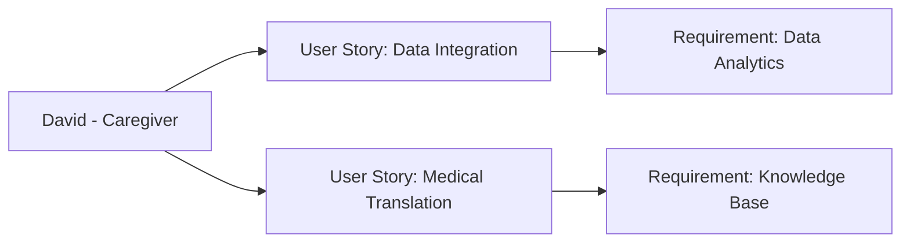

---
template:
  id: "user-persona"
  version: "1.0"
  category: "requirements"
  type: "user-research"
  parent: "base_template"

metadata:
  author: "Zebra MHH Team"
  version: "1.0"
  created: "2024-11-30"
  updated: "2024-11-30"
  status: "Draft"
  reviewers: 
    - "Technical Lead"
    - "UX Lead"
    - "Clinical Advisor"

document:
  key: "PER-002-family-caregiver"
  naming:
    pattern: "PER-002-family_caregiver"
    prefix: "PER"
    sequence:
      format: "002"
    descriptor: "family_caregiver"

ai:
  documentType: "user_persona"

# Family Caregiver Persona

## Basic Information

| Field | Details |
|-------|---------|
| **Name** | David Chen |
| **Age** | 36 |
| **Occupation** | Senior Software Engineer (Remote) |
| **Location** | Austin, TX |
| **Education** | M.S. in Computer Science |
| **Income Level** | High |
| **Family Status** | Married, two children (ages 6 and 3) |

## Profile Summary

David is the primary caregiver for his 3-year-old son, Lucas, who has an ultra-rare genetic condition affecting multiple organ systems. Despite his strong technical background in software development and data analysis, David initially found himself overwhelmed by the complexity of medical terminology, healthcare systems, and the fragmented nature of medical information.

Leveraging his engineering mindset, David approaches his son's care systematically, creating his own digital tools to track symptoms and treatments. He actively seeks to understand the medical aspects of Lucas's condition, frequently researching medical literature and participating in rare disease communities. He coordinates care between multiple specialists across different medical centers, including genetics, neurology, cardiology, and others.

## Technical Profile

| Aspect | Details |
|--------|---------|
| **Device Usage** | High |
| **Tech Comfort** | Advanced |
| **Primary Devices** | MacBook Pro, iPad Pro, iPhone |
| **Frequently Used Apps** | - Development: VS Code, GitHub
- Healthcare: Multiple Patient Portals
- Organization: Notion, Linear
- Research: PubMed, Google Scholar |
| **Digital Services** | - Development Platforms
- Medical Record Systems
- Research Databases
- Patient Community Platforms |

## Goals and Needs

### Primary Goals

1. Build a comprehensive system to track and analyze Lucas's medical data across all specialists and hospitals, with the ability to identify patterns and correlations in symptoms and treatments
2. Efficiently aggregate and share Lucas's complete medical history with new specialists, ensuring all providers understand his unique condition and care requirements. He usually struggles with scanned documents that he needs to convert to understandable, structured and analyzable formats, different custom formats offered for different portal patients, and normalize the data and merge them into the repository.

### Secondary Goals

1. Understand medical terminology and research to better participate in care decisions
2. Connect with other families and researchers studying similar conditions

## Pain Points and Frustrations

### Current Challenges

1. Data Integration: Struggling to aggregate and analyze medical data from multiple disconnected healthcare systems, patient portals, paper-scanned or pdf records, and clinical imaging in physical devices and convert it into actionable insights
2. Knowledge Gap: Despite technical expertise, finding it challenging to bridge the gap between technical knowledge and medical domain understanding

### Frustrations

1. System Fragmentation: Dealing with multiple disconnected healthcare portals and information systems that don't communicate with each other
2. Communication Barriers: Difficulty in effectively translating technical insights about patterns and correlations to medical professionals

## Preferences and Behaviors

### Communication Preferences

- Primary: Digital platforms with APIs and data integration capabilities
- Secondary: Video calls for remote consultations
- Avoided: Paper-based systems, manual data entry

### Decision-Making Factors

1. Data Quality: Values systems that enable structured data collection and analysis
2. Integration Capabilities: Prioritizes solutions that can connect with existing systems or import data seamlessly

## User Stories

1. As David, I want to integrate medical data from multiple sources into a unified system, so I can analyze patterns and trends in Lucas's condition using data science techniques
2. As David, I want to translate complex medical information into understandable formats, so I can better participate in care decisions and communicate with healthcare providers

## User Journey Scenarios
### Scenario 1: Data Integration from New Provider
1. Initial Setup
   - **Context**: Receiving records from a new specialist
   - **Actions**: 
     - Exports data from provider's portal
     - Converts unstructured PDFs to structured data
     - Integrates with existing analysis system
   - **Pain Points**: 
     - Inconsistent data formats
     - Manual data cleaning required
     - Time-consuming conversion process
   - **Desired Outcome**: Automated data integration pipeline

2. Pattern Analysis
   - **Context**: Monthly health trend analysis
   - **Actions**:
     - Aggregates data across providers
     - Runs statistical analysis
     - Generates visualization reports
   - **Success Metrics**:
     - Reduced analysis time
     - Improved pattern detection
     - Better communication with providers

### Scenario 2: Knowledge Sharing
1. Provider Communication
   - **Context**: Preparing for multi-specialist meeting
   - **Actions**:
     - Compiles data-driven insights
     - Creates visualizations of trends
     - Prepares technical-to-medical translations
   - **Requirements**:
     - Data visualization tools
     - Medical terminology mapping
   - **Success Indicators**:
     - Provider engagement with insights
     - Implementation of recommendations

## Success Metrics
### Data Management
- **Integration Efficiency**:
  - 75% reduction in manual data entry
  - Automated processing of common document formats
  - Real-time data synchronization where possible

### Knowledge Translation
- **Communication Effectiveness**:
  - Improved provider understanding of technical insights
  - Reduced time explaining data patterns
  - Better collaborative decision-making

### Care Coordination
- **Process Optimization**:
  - Streamlined information sharing
  - Reduced duplicate tests/procedures
  - Better cross-provider alignment

## Health Interaction Patterns
### Provider Interactions
- **Primary Care**: Monthly check-ins
- **Specialists Team**:
  - Geneticist: Quarterly
  - Neurologist: Monthly
  - Cardiologist: Bi-monthly
  - Physical Therapist: Weekly
- **Care Coordination**: Weekly data updates

### Data Collection Points
- Vital signs: Daily
- Medication tracking: Real-time
- Symptom logging: As occurs
- Development milestones: Weekly

## Requirements Traceability
### Related Documents
| Document Type | Reference ID | Description |
|--------------|--------------|-------------|
| User Story | US-003-data-integration | Integration of medical data from multiple sources |
| User Story | US-004-medical-translation | Translation of technical insights to medical context |
| Use Case | UC-003-analytics | Advanced analytics for pattern detection |
| Use Case | UC-004-knowledge-management | Medical knowledge management system |

### Impact Analysis
| Target Area | Confidence Level | Notes |
|------------|------------------|-------|
| Product Strategy | 95% | Critical for data-driven care management |
| Design Decisions | 90% | Influences technical integration capabilities |

### Supporting Documentation
- **Research Documents**: RES-2024-002-Caregiver-Tech-Needs
- **Interview Transcripts**: INT-2024-005-David-Chen
- **Additional References**: 
  - Technical Integration Specifications
  - Data Format Standards
  - Medical Terminology Mappings

## Decision-Making Characteristics
### Information Processing
- **Approach**: Data-driven, systematic
- **Tools**: Statistical analysis, visualization
- **Preferences**: 
  - Structured data formats
  - API-first solutions
  - Automated workflows

### Key Decision Factors
1. Data Quality and Reliability
   - Source verification
   - Error checking
   - Version control

2. Integration Capabilities
   - API availability
   - Data format compatibility
   - Automation potential

3. Analysis Features
   - Pattern detection
   - Trend visualization
   - Statistical significance testing

## Relationships and Dependencies

## Related Documentation
### EPICs:
- [Data Sharing and Collaboration Epic](../02-User_Stories/EPIC-004-data-sharing-collaboration.mdx)
- [Health Visualization Epic](../02-User_Stories/EPIC-003-health-visualization.mdx)

### User Stories:
- [Medical Translation](../02-User_Stories/US-004-medical-translation.mdx)
- [Health Timeline Visualization](../02-User_Stories/US-006-health-timeline.mdx)

## Validation and Review

| Aspect | Status | Notes |
|--------|--------|-------|
| Technical Review | Pending | Focus on integration capabilities |
| Clinical Review | Pending | To be reviewed by medical team |
| UX Review | Pending | Emphasis on data visualization |
| Validation | Pending | Awaiting stakeholder feedback |

## Change History

| Version | Date | Author | Changes |
|---------|------|--------|----------|
| 1.0 | 2024-11-30 | Zebra MHH Team | Initial persona creation |