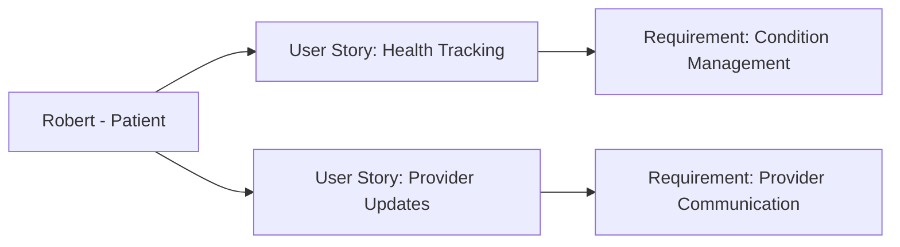

---
template:
  id: "user-persona"
  version: "1.0"
  category: "requirements"
  type: "user-research"
  parent: "base_template"

metadata:
  author: "Zebra MHH Team"
  version: "1.0"
  created: "2024-11-30"
  updated: "2024-11-30"
  status: "Draft"
  reviewers: 
    - "Technical Lead"
    - "UX Lead"
    - "Clinical Advisor"

document:
  key: "PER-003-complex-care-patient"
  naming:
    pattern: "PER-003-complex_care_patient"
    prefix: "PER"
    sequence:
      format: "003"
    descriptor: "complex_care_patient"

ai:
  documentType: "user_persona"

# Complex Care Patient Persona

## Basic Information

| Field | Details |
|-------|---------|
| **Name** | Robert Thompson |
| **Age** | 58 |
| **Occupation** | High School Teacher (Recently on medical leave) |
| **Location** | Denver, CO |
| **Education** | Bachelor's in Education |
| **Income Level** | Medium |
| **Family Status** | Divorced, two adult children |

## Profile Summary

Robert lives with multiple chronic conditions including Type 2 Diabetes, Rheumatoid Arthritis, and Chronic Heart Failure, each requiring different treatment protocols and specialist care. His health management is complicated by the interactions between his conditions and medications. While not tech-averse, he sometimes struggles with complex digital tools and prefers straightforward interfaces.

He regularly sees an endocrinologist, rheumatologist, cardiologist, and primary care physician, along with periodic consultations with other specialists. His complex medical needs have recently forced him to take medical leave from his teaching position, adding financial stress to his health challenges. Robert represents patients who must manage multiple chronic conditions simultaneously while coordinating between different healthcare providers and treatment plans.

## Technical Profile

| Aspect | Details |
|--------|---------|
| **Device Usage** | Medium |
| **Tech Comfort** | Basic to Intermediate |
| **Primary Devices** | Desktop PC, Android phone |
| **Frequently Used Apps** | - Healthcare: Basic health tracking apps
- Communication: Email, Facebook
- Work: Microsoft Office
- Organization: Phone calendar |
| **Digital Services** | - Email
- Patient Portals (multiple)
- Basic health monitoring apps
- Social media |

## Goals and Needs

### Primary Goals

1. Track and understand the interactions between his multiple conditions, medications, and treatments, particularly focusing on identifying patterns that might indicate worsening symptoms or potential complications
2. Coordinate care effectively between his multiple healthcare providers to ensure treatments for one condition don't adversely affect others

### Secondary Goals

1. Find reliable information about managing multiple chronic conditions and potential interactions
2. Maintain an organized record of his various medications, appointments, and treatment plans

## Pain Points and Frustrations

### Current Challenges

1. Care Coordination: Difficulty in managing multiple treatment plans and ensuring all his healthcare providers are aware of changes made by other specialists
2. Tracking Impact: Struggling to monitor how changes in one condition affect his other health issues, especially when starting new medications

### Frustrations

1. Information Overload: Feeling overwhelmed by the volume of medical information and treatment instructions from different providers
2. System Complexity: Finding it difficult to navigate multiple healthcare portals and tracking systems

## Preferences and Behaviors

### Communication Preferences

- Primary: Simple digital tools and phone calls
- Secondary: Text messages and email
- Avoided: Complex technical systems

### Decision-Making Factors

1. Simplicity: Prefers straightforward, easy-to-use interfaces that don't require extensive learning
2. Practicality: Values tools that help manage day-to-day health tasks without overwhelming complexity

## User Stories

1. As Robert, I want to track my various health conditions and medications in one place, so I can better understand how they interact and affect each other
2. As Robert, I want an easy way to share updates with all my healthcare providers, so they can make informed decisions about my treatment plans

## User Journey Scenarios
### Scenario 1: Daily Health Management
1. Morning Routine
   - **Context**: Managing multiple medications and health checks
   - **Actions**: 
     - Checks blood sugar levels
     - Takes morning medications
     - Records vital signs
     - Notes any overnight symptoms
   - **Pain Points**: 
     - Multiple apps for different conditions
     - Difficulty remembering medication timing
     - Confusion about medication interactions
   - **Desired Outcome**: Streamlined morning routine with clear guidance

2. Symptom Flare-up
   - **Context**: Experiencing increased joint pain while blood sugar is elevated
   - **Actions**:
     - Records symptoms in health diary
     - Checks medication history
     - Reviews recent diet changes
     - Contacts appropriate provider
   - **Success Metrics**:
     - Time to provider response
     - Accuracy of symptom documentation
     - Prevention of condition interactions

### Scenario 2: Provider Visit Preparation
1. Pre-appointment Organization
   - **Context**: Preparing for rheumatologist visit
   - **Actions**:
     - Gathers health data from multiple sources
     - Reviews medication changes
     - Lists questions and concerns
     - Prepares symptom summary
   - **Requirements**:
     - Simple data organization tools
     - Clear symptom tracking history
   - **Success Indicators**:
     - Comprehensive visit preparation
     - Effective communication with provider

## Success Metrics
### Health Management
- **Condition Tracking**:
  - Daily symptom logging completion rate
  - Medication adherence rate
  - Regular vital signs monitoring

### Care Coordination
- **Provider Communication**:
  - Reduced medication conflicts
  - Improved cross-provider awareness
  - Faster response to health changes

### Quality of Life
- **Daily Function**:
  - Maintained independence level
  - Reduced symptom interference
  - Better work-life balance

## Health Interaction Patterns
### Provider Interactions
- **Primary Care**: Monthly visits
- **Specialist Team**:
  - Endocrinologist: Every 3 months
  - Rheumatologist: Every 2 months
  - Cardiologist: Every 3 months
  - Nutritionist: Monthly
- **Emergency Care**: As needed (2-3 times/year)

### Health Monitoring Points
- Blood sugar: 3-4 times daily
- Blood pressure: Twice daily
- Weight: Daily
- Pain levels: As needed
- Medication tracking: Multiple times daily

## Requirements Traceability
### Related Documents
| Document Type | Reference ID | Description |
|--------------|--------------|-------------|
| User Story | US-005-health-tracking | Integrated condition tracking system |
| User Story | US-006-provider-updates | Streamlined provider communication |
| Use Case | UC-005-condition-management | Multiple condition management workflow |
| Use Case | UC-006-provider-communication | Cross-provider communication system |

### Impact Analysis
| Target Area | Confidence Level | Notes |
|------------|------------------|-------|
| Usability | 95% | Critical for daily adherence |
| Integration | 85% | Important for care coordination |

### Supporting Documentation
- **Research Documents**: RES-2024-003-Complex-Care-Needs
- **Interview Transcripts**: INT-2024-007-Robert-Thompson
- **Additional References**: 
  - Medication Interaction Guidelines
  - Condition Management Best Practices
  - Patient Education Materials

## Decision-Making Process
### Information Needs
- **Priority**: Clear, actionable guidance
- **Format**: Simple, visual presentations
- **Timing**: Regular, predictable updates

### Key Decision Factors
1. Ease of Use
   - Simple interfaces
   - Clear instructions
   - Minimal technical requirements

2. Health Impact
   - Condition interactions
   - Medication effects
   - Lifestyle modifications

3. Support Features
   - Reminder systems
   - Emergency protocols
   - Provider communication channels

## Relationships and Dependencies

## Related Documentation
### EPICs
#### Health Information Processing Epic
- [Health Information Processing Epic](../02-User_Stories/EPIC-002-health-information-processing.mdx)

#### AI-Powered Health Insights Epic
- [AI-Powered Health Insights Epic](../02-User_Stories/EPIC-005-ai-health-insights.mdx)

### User Stories
#### Health Tracking
- [Health Tracking](../02-User_Stories/US-003-health-tracking.mdx)

#### Condition Progression Visualization
- [Condition Progression Visualization](../02-User_Stories/US-009-condition-progression.mdx)

## Validation and Review

| Aspect | Status | Notes |
|--------|--------|-------|
| Technical Review | Pending | Focus on usability |
| Clinical Review | Pending | To be reviewed by primary care team |
| UX Review | Pending | Emphasis on simplicity |
| Validation | Pending | Awaiting stakeholder feedback |

## Change History

| Version | Date | Author | Changes |
|---------|------|--------|----------|
| 1.0 | 2024-11-30 | Zebra MHH Team | Initial persona creation |