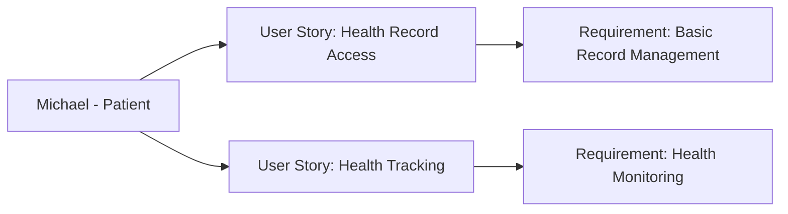

---
template:
  id: "user-persona"
  version: "1.0"
  category: "requirements"
  type: "user-research"
  parent: "base_template"

metadata:
  author: "Zebra MHH Team"
  version: "1.0"
  created: "2024-11-30"
  updated: "2024-11-30"
  status: "Draft"
  reviewers: 
    - "Technical Lead"
    - "UX Lead"
    - "Clinical Advisor"

document:
  key: "PER-004-regular-care-patient"
  naming:
    pattern: "PER-004-regular_care_patient"
    prefix: "PER"
    sequence:
      format: "004"
    descriptor: "regular_care_patient"

ai:
  documentType: "user_persona"

# Regular Care Patient Persona

## Basic Information

| Field | Details |
|-------|---------|
| **Name** | Michael Foster |
| **Age** | 29 |
| **Occupation** | Marketing Specialist |
| **Location** | Portland, OR |
| **Education** | Bachelor's in Marketing |
| **Income Level** | Medium |
| **Family Status** | Single |

## Profile Summary

Michael represents a generally healthy individual who requires basic healthcare management for routine check-ups and occasional acute care needs. He maintains an active lifestyle and is interested in preventive health measures. While he doesn't have any chronic conditions, he wants to stay proactive about his health and maintain organized health records. He typically visits his primary care physician for annual check-ups and occasional minor health issues, with sporadic visits to specialists for specific concerns.

Michael's interaction with healthcare systems is primarily through routine preventive care, occasional urgent care visits, and basic health monitoring. He's interested in using technology to maintain his health records but doesn't require complex medical data management.

## Technical Profile

| Aspect | Details |
|--------|---------|
| **Device Usage** | High |
| **Tech Comfort** | Intermediate |
| **Primary Devices** | iPhone, MacBook Air |
| **Frequently Used Apps** | - Health tracking: Apple Health
- Fitness apps
- One patient portal
- Calendar and reminders |
| **Digital Services** | - Cloud storage
- Health and wellness apps
- Basic medical record access |

## Goals and Needs

### Primary Goals

1. Maintain organized records of basic health information, including immunizations, check-ups, and occasional urgent care visits for easy access when needed
2. Track general health metrics and preventive care schedules to maintain optimal health and catch potential issues early

### Secondary Goals

1. Access and understand basic health information and preventive care recommendations
2. Keep track of medical expenses and insurance claims efficiently

## Pain Points and Frustrations

### Current Challenges

1. Record Accessibility: Difficulty accessing historical health records when switching healthcare providers or during urgent care visits
2. Health Monitoring: Lack of integration between fitness tracking and medical record systems

### Frustrations

1. Information Fragmentation: Basic health information spread across different systems and providers
2. Appointment Management: Challenges in scheduling and managing healthcare appointments efficiently

## Preferences and Behaviors

### Communication Preferences

- Primary: Mobile apps and digital platforms
- Secondary: Email
- Avoided: Phone calls, paper forms

### Decision-Making Factors

1. Convenience: Values easy-to-use digital solutions that fit into daily routine
2. Efficiency: Prefers streamlined processes for managing basic health needs

## User Stories

1. As Michael, I want to easily access my health records and share them when needed, so I can maintain continuity of care across different providers
2. As Michael, I want to track my health metrics and preventive care schedule, so I can stay proactive about my health maintenance

## User Journey Scenarios
### Scenario 1: Annual Check-up Preparation
1. Pre-visit Organization
   - **Context**: Preparing for annual physical
   - **Actions**: 
     - Reviews previous visit notes
     - Gathers fitness tracking data
     - Lists health questions/concerns
     - Checks preventive care schedule
   - **Pain Points**: 
     - Scattered health information
     - Incomplete health history
     - Disconnected fitness data
   - **Desired Outcome**: Comprehensive health review

2. Urgent Care Visit
   - **Context**: Unexpected minor injury during weekend
   - **Actions**:
     - Locates nearest urgent care
     - Accesses health history
     - Shares insurance information
     - Records visit information
   - **Success Metrics**:
     - Quick access to health info
     - Efficient provider communication
     - Complete visit documentation

### Scenario 2: Wellness Tracking
1. Regular Monitoring
   - **Context**: Daily health and fitness tracking
   - **Actions**:
     - Records workout data
     - Monitors sleep patterns
     - Tracks nutrition goals
     - Updates wellness metrics
   - **Requirements**:
     - Integration with fitness apps
     - Simple data visualization
   - **Success Indicators**:
     - Consistent tracking habits
     - Achievement of wellness goals

## Success Metrics
### Health Management
- **Record Organization**:
  - Digital health record completion
  - Preventive care compliance
  - Documentation accuracy

### Wellness Tracking
- **Fitness Goals**:
  - Regular exercise tracking
  - Sleep quality monitoring
  - Nutrition logging completion

### Care Coordination
- **Provider Interaction**:
  - Timely appointment scheduling
  - Efficient information sharing
  - Follow-up completion rate

## Health Interaction Patterns
### Provider Interactions
- **Primary Care**: Annual physical
- **Dental Care**: Bi-annual cleanings
- **Vision Care**: Annual check-up
- **Urgent Care**: 1-2 times/year
- **Specialists**: As needed (rare)

### Health Monitoring Points
- Exercise: Daily tracking
- Sleep: Nightly monitoring
- Weight: Weekly
- Vital signs: Monthly
- Wellness metrics: Ongoing

## Relationships and Dependencies

## Related Documentation
### EPICs:
- [Health Management Epic](../02-User_Stories/EPIC-001-health-management.mdx)
- [Wellness Tracking Epic](../02-User_Stories/EPIC-002-wellness-tracking.mdx)
- [Health Visualization Epic](../02-User_Stories/EPIC-003-health-visualization.mdx)
- [User Onboarding Epic](../02-User_Stories/EPIC-009-user-onboarding.mdx)

### User Stories:
- [US-007-record-access](../02-User_Stories/US-007-record-access.mdx)
- [US-008-health-tracking](../02-User_Stories/US-008-health-tracking.mdx)
- [3D Body Visualization](../02-User_Stories/US-005-3d-body-visualization.mdx)
- [Custom View Management](../02-User_Stories/US-008-custom-view-management.mdx)

## Requirements Traceability
### Related Documents
| Document Type | Reference ID | Description |
|--------------|--------------|-------------|
| User Story | US-007-record-access | Basic health record management |
| User Story | US-008-health-tracking | Wellness monitoring system |
| Use Case | UC-007-basic-health-management | Regular care workflow |
| Use Case | UC-008-preventive-care | Preventive health management |

### Impact Analysis
| Target Area | Confidence Level | Notes |
|------------|------------------|-------|
| Convenience | 95% | Essential for user adoption |
| Integration | 90% | Important for fitness tracking |

### Supporting Documentation
- **Research Documents**: RES-2024-004-Regular-Care-Needs
- **Interview Transcripts**: INT-2024-009-Michael-Foster
- **Additional References**: 
  - Preventive Care Guidelines
  - Wellness Tracking Best Practices
  - Digital Health Integration Standards

## Wellness Focus
### Health Goals
- **Priority**: Preventive care and fitness
- **Approach**: Data-driven wellness
- **Motivation**: Long-term health maintenance

### Key Success Factors
1. Convenience
   - Mobile-first solutions
   - Quick data entry
   - Automated tracking

2. Integration
   - Fitness app connectivity
   - Health record access
   - Insurance information

3. Engagement Features
   - Goal tracking
   - Progress visualization
   - Wellness recommendations

## Validation and Review

| Aspect | Status | Notes |
|--------|--------|-------|
| Technical Review | Pending | Focus on basic functionality |
| Clinical Review | Pending | To be reviewed by primary care team |
| UX Review | Pending | Emphasis on user convenience |
| Validation | Pending | Awaiting stakeholder feedback |

## Change History

| Version | Date | Author | Changes |
|---------|------|--------|----------|
| 1.0 | 2024-11-30 | Zebra MHH Team | Initial persona creation |