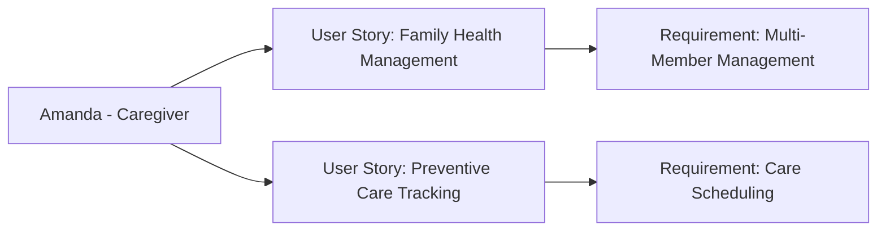

---
template:
  id: "user-persona"
  version: "1.0"
  category: "requirements"
  type: "user-research"
  parent: "base_template"

metadata:
  author: "Zebra MHH Team"
  version: "1.0"
  created: "2024-11-30"
  updated: "2024-11-30"
  status: "Draft"
  reviewers: 
    - "Technical Lead"
    - "UX Lead"
    - "Clinical Advisor"

document:
  key: "PER-005-regular-family-caregiver"
  naming:
    pattern: "PER-005-regular_family_caregiver"
    prefix: "PER"
    sequence:
      format: "005"
    descriptor: "regular_family_caregiver"

ai:
  documentType: "user_persona"

# Regular Family Caregiver Persona

## Basic Information

| Field | Details |
|-------|---------|
| **Name** | Amanda Parker |
| **Age** | 42 |
| **Occupation** | Project Manager (Hybrid work) |
| **Location** | Seattle, WA |
| **Education** | Bachelor's in Business Administration |
| **Income Level** | Medium-High |
| **Family Status** | Married, three children (ages 13, 10, and 7) |

## Profile Summary

Amanda manages healthcare for her entire family, including three children with typical healthcare needs and her father who has common age-related conditions (hypertension and type 2 diabetes). She coordinates regular check-ups, vaccinations, dental visits, and specialist appointments for the whole family while balancing a demanding career. She represents caregivers who handle routine healthcare management for multiple family members across different age groups.

As the family's healthcare coordinator, she maintains records for five people, manages multiple appointments, and ensures medication adherence for her father. While not dealing with rare conditions, she needs to track various health metrics and coordinate between different healthcare providers efficiently.

## Technical Profile

| Aspect | Details |
|--------|---------|
| **Device Usage** | Medium |
| **Tech Comfort** | Intermediate |
| **Primary Devices** | Windows laptop, Samsung phone |
| **Frequently Used Apps** | - Organization: Google Calendar, Notes
- Healthcare: Family health tracking app
- Communication: Teams, WhatsApp
- Planning: Microsoft Office Suite |
| **Digital Services** | - Family calendar
- Multiple patient portals
- Prescription management apps
- Family location sharing |

## Goals and Needs

### Primary Goals

1. Coordinate and track healthcare appointments, medications, and records for multiple family members across different healthcare providers
2. Maintain organized health histories and current health status for each family member for easy access during medical visits

### Secondary Goals

1. Monitor preventive care schedules and ensure timely check-ups for all family members
2. Keep track of health-related expenses and insurance claims for the whole family

## Pain Points and Frustrations

### Current Challenges

1. Schedule Management: Difficulty in coordinating multiple healthcare appointments around work and school schedules
2. Information Organization: Struggling to keep track of different family members' health histories, medications, and preventive care needs

### Frustrations

1. Time Management: Balancing healthcare coordination with work and family responsibilities
2. System Fragmentation: Dealing with multiple healthcare portals and providers for different family members

## Preferences and Behaviors

### Communication Preferences

- Primary: Mobile apps and calendar integration
- Secondary: Email notifications
- Avoided: Paper records, multiple phone calls

### Decision-Making Factors

1. Time Efficiency: Values solutions that help manage family healthcare without overwhelming her schedule
2. Organization: Prefers tools that help maintain clear records and reminders

## User Stories

1. As Amanda, I want to manage healthcare schedules and records for my entire family in one place, so I can ensure everyone receives timely care while staying organized
2. As Amanda, I want to track preventive care needs and medications for different family members, so I can maintain their health proactively

## User Journey Scenarios
### Scenario 1: Weekly Health Coordination
1. Family Schedule Management
   - **Context**: Planning upcoming medical appointments
   - **Actions**: 
     - Reviews family calendar
     - Checks school schedules
     - Coordinates with work meetings
     - Schedules appointments
   - **Pain Points**: 
     - Multiple scheduling conflicts
     - Different portal systems
     - Work-life balance
   - **Desired Outcome**: Efficiently scheduled appointments

2. Medication Management
   - **Context**: Managing father's diabetes medications
   - **Actions**:
     - Checks medication inventory
     - Reviews prescription refills
     - Updates medication schedule
     - Coordinates pharmacy pickup
   - **Success Metrics**:
     - Medication adherence rate
     - Timely refills
     - Reduced scheduling conflicts

### Scenario 2: Family Health Review
1. Monthly Health Check
   - **Context**: Regular family health status review
   - **Actions**:
     - Updates health records
     - Reviews preventive care needs
     - Checks vaccination schedules
     - Plans routine check-ups
   - **Requirements**:
     - Multi-member tracking
     - Calendar integration
   - **Success Indicators**:
     - Complete health records
     - Timely preventive care

## Success Metrics
### Family Health Management
- **Appointment Coordination**:
  - Scheduling efficiency rate
  - Appointment attendance rate
  - Minimal scheduling conflicts

### Care Tracking
- **Preventive Care**:
  - Vaccination compliance
  - Check-up completion
  - Dental visit adherence

### Documentation
- **Record Management**:
  - Updated health histories
  - Medication tracking accuracy
  - Insurance information current

## Health Interaction Patterns
### Family Member Care Needs
- **Children (13, 10, 7)**:
  - Annual physicals
  - Bi-annual dental
  - Sports physicals
  - Urgent care (2-3/year each)
- **Father**:
  - Quarterly diabetes check
  - Monthly medication review
  - Blood pressure monitoring
- **Personal**:
  - Annual check-up
  - Preventive screenings

### Care Coordination Points
- Appointment scheduling: Weekly
- Medication management: Daily
- Health record updates: Monthly
- Insurance review: Quarterly

## Requirements Traceability
### Related Documents
| Document Type | Reference ID | Description |
|--------------|--------------|-------------|
| User Story | US-009-family-health | Multi-member health management |
| User Story | US-010-preventive-care | Family preventive care tracking |
| Use Case | UC-008-family-management | Family health coordination |
| Use Case | UC-009-care-scheduling | Multi-member scheduling system |

### Impact Analysis
| Target Area | Confidence Level | Notes |
|------------|------------------|-------|
| Organization | 95% | Critical for family management |
| Time Efficiency | 90% | Essential for work-life balance |

### Supporting Documentation
- **Research Documents**: RES-2024-005-Family-Care-Needs
- **Interview Transcripts**: INT-2024-011-Amanda-Parker
- **Additional References**: 
  - Family Health Management Guidelines
  - Preventive Care Schedules
  - School Health Requirements

## Family Care Strategy
### Management Approach
- **Priority**: Efficient coordination
- **Style**: Proactive planning
- **Tools**: Digital organization

### Key Success Factors
1. Time Management
   - Calendar integration
   - Automated reminders
   - Batch scheduling

2. Information Organization
   - Family health dashboard
   - Document management
   - Care history tracking

3. Communication Tools
   - Provider messaging
   - Family updates
   - Appointment confirmations

## Relationships and Dependencies

## Related Documentation
### EPICs
#### Data Sharing and Collaboration Epic
- [Data Sharing and Collaboration Epic](../02-User_Stories/EPIC-004-data-sharing-collaboration.mdx)

#### Medical Knowledge Base Epic
- [Medical Knowledge Base Epic](../02-User_Stories/EPIC-006-knowledge-base.mdx)

### User Stories
#### Provider Data Sharing
- [Provider Data Sharing](../02-User_Stories/US-010-provider-sharing.mdx)

#### Family Access Management
- [Family Access Management](../02-User_Stories/US-016-family-access.mdx)

## Validation and Review

| Aspect | Status | Notes |
|--------|--------|-------|
| Technical Review | Pending | Focus on family management features |
| Clinical Review | Pending | To be reviewed by family practice team |
| UX Review | Pending | Emphasis on multi-user management |
| Validation | Pending | Awaiting stakeholder feedback |

## Change History

| Version | Date | Author | Changes |
|---------|------|--------|----------|
| 1.0 | 2024-11-30 | Zebra MHH Team | Initial persona creation |