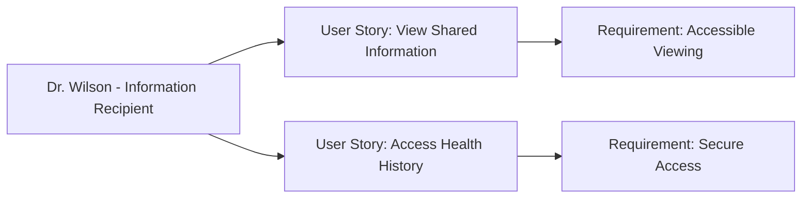

---
template:
  id: "user-persona"
  version: "1.0"
  category: "requirements"
  type: "user-research"
  parent: "base_template"

metadata:
  author: "Zebra MHH Team"
  version: "1.1"
  created: "2024-11-30"
  updated: "2024-11-30"
  status: "Draft"
  reviewers: 
    - "Technical Lead"
    - "UX Lead"
    - "Clinical Advisor"

document:
  key: "PER-006-primary-care-physician"
  naming:
    pattern: "PER-006-primary_care_physician"
    prefix: "PER"
    sequence:
      format: "006"
    descriptor: "primary_care_physician"

ai:
  documentType: "user_persona"

# Primary Care Physician as Information Recipient

## Basic Information

| Field | Details |
|-------|---------|
| **Name** | Dr. James Wilson |
| **Age** | 48 |
| **Occupation** | Primary Care Physician |
| **Location** | Minneapolis, MN |
| **Education** | MD from University of Minnesota |
| **Income Level** | High |
| **Family Status** | Married, one child |

## Profile Summary

Dr. Wilson represents a primary care physician who receives shared health information from patients using the Zebra MHH platform. He is one of several healthcare providers who patients might grant access to their consolidated health data. While he maintains his own EHR system for official medical records, he appreciates when patients can provide organized, comprehensive health information, especially those with complex conditions or those seeing multiple specialists.

He values receiving clear, structured health information from his patients but doesn't need to be a primary user of the system. His interaction with Zebra MHH is primarily as a recipient of patient-shared health data, which helps him better understand his patients' overall health situation and coordinate with other providers when necessary.

## Technical Profile

| Aspect | Details |
|--------|---------|
| **Device Usage** | Medium |
| **Tech Comfort** | Basic to Intermediate |
| **Primary Devices** | Clinic desktop, tablet |
| **Frequently Used Apps** | - Primary: Clinical EHR system
- Secondary: Web-based patient portals |
| **Digital Services** | - EHR System
- Secure message platforms
- Web-based health record viewers |

## Goals and Needs

### Primary Goals

1. Receive well-organized, relevant patient health information through secure, accessible means when patients choose to share it
2. View shared patient data in a format that's easy to understand and integrate with his clinical decision-making process

### Secondary Goals

1. Access historical patient health information when granted permission
2. Understand patient-tracked health metrics and observations between visits

## Pain Points and Frustrations

### Current Challenges

1. Data Access: Difficulty accessing patient-provided information in a format that's easy to review during time-limited appointments
2. Information Context: Receiving fragmented or disorganized health information from patients about their care with other providers

### Frustrations

1. Time Management: Limited time to review patient-provided information during appointments
2. Format Consistency: Dealing with health information shared in various formats and levels of detail

## Preferences and Behaviors

### Communication Preferences

- Primary: Secure, web-based access
- Secondary: Downloadable reports
- Avoided: Complex new systems to learn

### Decision-Making Factors

1. Accessibility: Easy access to patient-shared information without complex new workflows
2. Clarity: Clear presentation of relevant patient health information

## User Stories

1. As Dr. Wilson, I want to easily view patient-shared health information in a clear, organized format, so I can quickly understand my patient's overall health situation during appointments
2. As Dr. Wilson, I want to access comprehensive health histories when patients grant permission, so I can make better-informed clinical decisions

## User Journey Scenarios
### Scenario 1: Patient Visit Review
1. Pre-visit Information Review
   - **Context**: Preparing for patient appointment
   - **Actions**: 
     - Accesses shared health data
     - Reviews patient history
     - Checks recent specialist notes
     - Notes medication changes
   - **Pain Points**: 
     - Limited preparation time
     - Multiple data sources
     - Information overload
   - **Desired Outcome**: Quick, comprehensive patient overview

2. During Visit Information Access
   - **Context**: Patient discussing specialist care
   - **Actions**:
     - References shared records
     - Views trending data
     - Checks medication list
     - Reviews test results
   - **Success Metrics**:
     - Quick information retrieval
     - Complete data visibility
     - Efficient consultation time

### Scenario 2: Care Coordination
1. Specialist Communication
   - **Context**: Coordinating with specialists
   - **Actions**:
     - Reviews shared care plans
     - Checks treatment updates
     - Assesses medication changes
     - Notes care recommendations
   - **Requirements**:
     - Clear information display
     - Easy navigation
   - **Success Indicators**:
     - Effective care coordination
     - Reduced communication gaps

## Success Metrics
### Information Access
- **Data Retrieval**:
  - Quick access speed
  - Information completeness
  - Format consistency

### Clinical Efficiency
- **Visit Management**:
  - Reduced information gathering time
  - Improved decision-making speed
  - Enhanced care coordination

### Patient Care
- **Care Quality**:
  - Better-informed decisions
  - Comprehensive care view
  - Reduced information gaps

## Clinical Interaction Patterns
### Patient Visit Types
- **Regular Check-ups**:
  - Health history review
  - Preventive care planning
  - Medication management
- **Complex Cases**:
  - Specialist coordination
  - Treatment review
  - Care plan updates
- **Follow-ups**:
  - Progress monitoring
  - Treatment adjustments
  - Care plan compliance

### Information Access Points
- Pre-visit review: 5-10 minutes
- During consultation: Real-time
- Post-visit documentation: 10-15 minutes
- Care coordination: As needed

## Requirements Traceability
### Related Documents
| Document Type | Reference ID | Description |
|--------------|--------------|-------------|
| User Story | US-011-information-viewing | Efficient information access |
| User Story | US-012-history-access | Comprehensive history review |
| Use Case | UC-010-provider-access | Provider information workflow |
| Use Case | UC-011-care-coordination | Multi-provider coordination |

### Impact Analysis
| Target Area | Confidence Level | Notes |
|------------|------------------|-------|
| Clinical Efficiency | 95% | Critical for time management |
| Care Quality | 90% | Essential for decision making |

### Supporting Documentation
- **Research Documents**: RES-2024-006-Provider-Needs
- **Interview Transcripts**: INT-2024-013-Dr-Wilson
- **Additional References**: 
  - Clinical Workflow Guidelines
  - Information Access Standards
  - Care Coordination Best Practices

## Clinical Workflow Integration
### Access Requirements
- **Priority**: Seamless integration
- **Method**: Web-based viewing
- **Timing**: Quick access points

### Key Success Factors
1. Efficiency
   - One-click access
   - Clear data organization
   - Relevant information first

2. Completeness
   - Full health history
   - Specialist updates
   - Medication tracking

3. Usability Features
   - Quick summary views
   - Important alerts
   - Easy navigation

## Relationships and Dependencies

## Related Documentation
### EPICs
#### Health Data Management Epic
- [Health Data Management Epic](../02-User_Stories/EPIC-001-health-data-management.mdx)

#### Security and Compliance Epic
- [Security and Compliance Epic](../02-User_Stories/EPIC-008-security-compliance.mdx)

### User Stories
#### Access Management
- [Access Management](../02-User_Stories/US-012-access-management.mdx)

#### Audit Logging
- [Audit Logging](../02-User_Stories/US-017-audit-logging.mdx)

## Validation and Review

| Aspect | Status | Notes |
|--------|--------|-------|
| Technical Review | Pending | Focus on accessibility |
| Clinical Review | Pending | Verify information viewing needs |
| UX Review | Pending | Emphasis on viewing experience |
| Validation | Pending | Awaiting stakeholder feedback |

## Change History

| Version | Date | Author | Changes |
|---------|------|--------|----------|
| 1.0 | 2024-11-30 | Zebra MHH Team | Initial persona creation |
| 1.1 | 2024-11-30 | Zebra MHH Team | Enhanced with user journey scenarios, success metrics, and clinical interaction patterns |