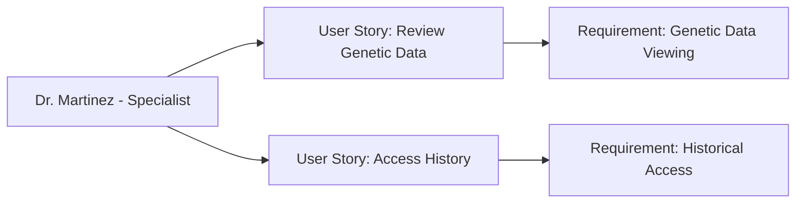

---
template:
  id: "user-persona"
  version: "1.0"
  category: "requirements"
  type: "user-research"
  parent: "base_template"

metadata:
  author: "Zebra MHH Team"
  version: "1.0"
  created: "2024-11-30"
  updated: "2024-11-30"
  status: "Draft"
  reviewers: 
    - "Technical Lead"
    - "UX Lead"
    - "Clinical Advisor"
    - "Rare Disease Specialist"

document:
  key: "PER-007-specialist-physician"
  naming:
    pattern: "PER-007-specialist_physician"
    prefix: "PER"
    sequence:
      format: "007"
    descriptor: "specialist_physician"

ai:
  documentType: "user_persona"

# Specialist Physician as Information Recipient

## Basic Information

| Field | Details |
|-------|---------|
| **Name** | Dr. Sarah Martinez |
| **Age** | 44 |
| **Occupation** | Clinical Geneticist and Rare Disease Specialist |
| **Location** | Boston, MA |
| **Education** | MD, Ph.D. in Medical Genetics |
| **Income Level** | High |
| **Family Status** | Married, two children |

## Profile Summary

Dr. Martinez is a clinical geneticist and rare disease specialist at a major academic medical center, receiving detailed health information shared by patients and families through the Zebra MHH platform. Her practice focuses on diagnosing and treating patients with rare genetic conditions, often participating in their long-term care management alongside other specialists.

As an information recipient, she particularly values when patients can share comprehensive genetic testing results, detailed symptom histories, and responses to various treatments. She frequently collaborates with multiple specialists across different institutions for each patient's care, making access to well-organized patient-provided information crucial for effective treatment planning.

## Technical Profile

| Aspect | Details |
|--------|---------|
| **Device Usage** | Medium |
| **Tech Comfort** | Intermediate |
| **Primary Devices** | Hospital workstation, clinic laptop |
| **Frequently Used Apps** | - Medical: Genetic databases, clinical research tools
- Basic: Secure medical record viewers
- Research: Scientific literature databases |
| **Digital Services** | - Hospital EMR system
- Genetic testing platforms
- Patient data viewing portals |

## Goals and Needs

### Primary Goals

1. Access comprehensive patient-shared information about genetic testing, family history, and detailed symptom progression to support diagnostic and treatment decisions
2. Review patient-tracked data about responses to treatments and symptom patterns between appointments when granted access

### Secondary Goals

1. Understand the full scope of care being provided by other specialists when patients share this information
2. Access historical health records and previous genetic assessments when patients grant permission

## Pain Points and Frustrations

### Current Challenges

1. Data Integration: Difficulty piecing together complex medical histories and genetic information shared by patients from multiple sources
2. Longitudinal Tracking: Challenges in accessing detailed symptom progression and treatment response data between visits

### Frustrations

1. Information Gaps: Receiving incomplete or fragmented information about patients' care with other specialists
2. Time Constraints: Limited time to review extensive patient histories during consultations

## Preferences and Behaviors

### Communication Preferences

- Primary: Secure web-based access to shared patient data
- Secondary: Structured clinical summaries
- Avoided: Complex new systems requiring extensive training

### Decision-Making Factors

1. Comprehensiveness: Values complete, well-organized patient histories and genetic information
2. Accessibility: Prefers easy access to patient-shared data without disrupting clinical workflow

## User Stories

1. As Dr. Martinez, I want to efficiently review patient-shared genetic information and detailed symptom histories, so I can make informed decisions during limited consultation times
2. As Dr. Martinez, I want to access patient-granted historical health records and treatment responses, so I can better understand the progression of rare conditions

## User Journey Scenarios
### Scenario 1: Accessing Patient-Shared Information
1. Initial Access Setup
   - **Context**: Receiving invitation to view patient data
   - **Actions**: 
     - Accepts access invitation
     - Views shared documentation
     - Downloads relevant records
     - Acknowledges data access
   - **Pain Points**: 
     - Limited familiarity with platform
     - Time constraints for review
     - Various file formats
   - **Desired Outcome**: Quick access to needed information

2. Information Review
   - **Context**: Reviewing patient-provided data
   - **Actions**:
     - Views consolidated health history
     - Downloads shared test results
     - Accesses symptom tracking data
     - Reviews treatment timeline
   - **Success Metrics**:
     - Efficient information retrieval
     - Complete data access
     - Clear data organization

### Scenario 2: Using Shared Health Data
1. Data Utilization
   - **Context**: Using patient-provided information
   - **Actions**:
     - Downloads relevant records
     - Imports into clinical systems
     - References during consultation
     - Provides feedback on data needs
   - **Requirements**:
     - Simple download process
     - Standard file formats
   - **Success Indicators**:
     - Successful data utilization
     - Minimal technical barriers

## Success Metrics
### Information Access
- **Data Retrieval**:
  - Quick access to shared records
  - Easy navigation of platform
  - Successful file downloads

### Data Utilization
- **Information Use**:
  - Successful record imports
  - Clear data presentation
  - Efficient consultation support

### Platform Interaction
- **User Experience**:
  - Minimal learning curve
  - Straightforward navigation
  - Clear access permissions

## Platform Interaction Patterns
### Access Types
- **Initial Setup**:
  - Account activation
  - Permission acceptance
  - Platform orientation
- **Regular Access**:
  - Record viewing
  - File downloads
  - Data exports
- **Special Requests**:
  - Additional data access
  - Historical record retrieval

### Information Access Points
- New patient data: As shared
- Updated records: When available
- Treatment updates: As provided
- Test results: When uploaded

## Requirements Traceability
### Related Documents
| Document Type | Reference ID | Description |
|--------------|--------------|-------------|
| User Story | US-013-data-access | Basic information viewing |
| User Story | US-014-data-retrieval | Record download system |
| Use Case | UC-012-provider-viewing | Information access workflow |
| Use Case | UC-013-data-export | Data export patterns |

### Impact Analysis
| Target Area | Confidence Level | Notes |
|------------|------------------|-------|
| Information Access | 95% | Critical for data utilization |
| Platform Usability | 90% | Important for adoption |

### Supporting Documentation
- **Research Documents**: RES-2024-007-Provider-Access-Needs
- **Interview Transcripts**: INT-2024-015-Dr-Martinez
- **Additional References**: 
  - Data Access Guidelines
  - File Format Standards
  - Security Protocols

## Platform Access Requirements
### Basic Needs
- **Priority**: Simple information access
- **Format**: Standard file downloads
- **Timing**: Quick data retrieval

### Key Success Factors
1. Accessibility
   - One-click access
   - Clear navigation
   - Simple download process

2. Data Organization
   - Logical structure
   - Clear categorization
   - Easy search

3. Support Features
   - Access instructions
   - Format guidelines
   - Help resources

## Relationships and Dependencies

## Related Documentation
### EPICs
#### Health Information Processing Epic
- [Health Information Processing Epic](../02-User_Stories/EPIC-002-health-information-processing.mdx)

#### AI-Powered Health Insights Epic
- [AI-Powered Health Insights Epic](../02-User_Stories/EPIC-005-ai-health-insights.mdx)

### User Stories
#### Medical Translation
- [Medical Translation](../02-User_Stories/US-004-medical-translation.mdx)

#### Treatment Recommendations
- [Treatment Recommendations](../02-User_Stories/US-015-treatment-recommendations.mdx)

## Validation and Review

| Aspect | Status | Notes |
|--------|--------|-------|
| Technical Review | Pending | Focus on genetic data access |
| Clinical Review | Pending | Verify specialist needs |
| UX Review | Pending | Emphasis on efficient review |
| Validation | Pending | Awaiting specialist feedback |

## Change History

| Version | Date | Author | Changes |
|---------|------|--------|----------|
| 1.0 | 2024-11-30 | Zebra MHH Team | Initial persona creation |

## Clinical Interaction Patterns
### Patient Visit Types
- **Initial Consultations**:
  - Genetic review: 30-45 minutes
  - History analysis: 20-30 minutes
  - Care planning: 15-20 minutes
- **Follow-up Visits**:
  - Progress review: 20-30 minutes
  - Treatment adjustment: 15-20 minutes
  - Care coordination: 10-15 minutes
- **Emergency Consultations**:
  - Rapid case review: 10-15 minutes
  - Immediate intervention: As needed

### Information Requirements
- Genetic test results: Complete data
- Family history: Multi-generation
- Symptom progression: Detailed timeline
- Treatment responses: Quantitative data