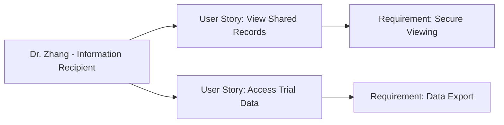

---
template:
  id: "user-persona"
  version: "1.0"
  category: "requirements"
  type: "user-research"
  parent: "base_template"

metadata:
  author: "Zebra MHH Team"
  version: "1.1"
  created: "2024-11-30"
  updated: "2024-11-30"
  status: "Draft"
  reviewers: 
    - "Technical Lead"
    - "UX Lead"
    - "Clinical Research Director"

document:
  key: "PER-008-research-specialist"
  naming:
    pattern: "PER-008-research_specialist"
    prefix: "PER"
    sequence:
      format: "008"
    descriptor: "research_specialist"

ai:
  documentType: "user_persona"

# Clinical Research Specialist as Information Recipient

## Basic Information

| Field | Details |
|-------|---------|
| **Name** | Dr. Alex Zhang |
| **Age** | 39 |
| **Occupation** | Clinical Trial Researcher & Genetic Research Specialist |
| **Location** | San Francisco, CA |
| **Education** | MD, Ph.D. in Human Genetics |
| **Income Level** | High |
| **Family Status** | Single |

## Profile Summary

Dr. Zhang is a clinical researcher who receives access to patient health information through Zebra MHH when patients choose to share their data. As a specialist in rare genetic conditions, they are sometimes invited by patients to view their comprehensive health history, either because the patient is participating in their clinical trial or because the patient is seeking expertise for potential research opportunities.

They appreciate when patients can provide organized access to their complete health journey, including genetic testing results, detailed symptom progression, and treatment responses. This information helps them better understand potential trial participants and monitor enrolled patients' overall health status alongside their trial-specific data collection.

## Technical Profile

| Aspect | Details |
|--------|---------|
| **Device Usage** | Medium |
| **Tech Comfort** | Intermediate |
| **Primary Devices** | Research workstation, tablet |
| **Frequently Used Apps** | - Primary: Clinical trial management system
- Secondary: Web-based data viewers
- Basic: Secure document access |
| **Digital Services** | - Clinical trial platforms
- Research databases
- Secure data access portals |

## Goals and Needs

### Primary Goals

1. View comprehensive patient health information when granted access by trial participants or potential participants, to better understand their overall health status and care journey
2. Access organized historical health records and current symptoms when patients share them, to complement trial-specific data collection

### Secondary Goals

1. Download relevant patient-shared data in standard formats for integration with research systems
2. Understand the complete care context of trial participants through patient-granted access to their health records

## Pain Points and Frustrations

### Current Challenges

1. Visibility: Limited access to patient's overall health context beyond trial-specific data collection
2. Integration: Difficulty incorporating patient-shared information with trial-specific data collection systems

### Frustrations

1. Context Gaps: Missing important health context about trial participants between scheduled trial visits
2. Access Management: Managing different levels of access granted by different patients

## Preferences and Behaviors

### Communication Preferences

- Primary: Secure web access to patient-shared information
- Secondary: Downloadable standardized reports
- Avoided: Complex new systems requiring extensive training

### Decision-Making Factors

1. Completeness: Values access to comprehensive patient histories when shared
2. Efficiency: Prefers straightforward access to patient-provided information

## User Journey Scenarios
### Scenario 1: Initial Platform Access
1. Access Setup
   - **Context**: Receiving patient data sharing invitation
   - **Actions**: 
     - Receives access invitation
     - Creates platform account
     - Accepts data sharing terms
     - Reviews access permissions
   - **Pain Points**: 
     - New platform familiarization
     - Access level understanding
     - Time management
   - **Desired Outcome**: Simple, secure access setup

2. Data Review
   - **Context**: First access to shared records
   - **Actions**:
     - Navigates shared information
     - Downloads permitted data
     - Reviews sharing scope
     - Confirms data receipt
   - **Success Metrics**:
     - Clear access boundaries
     - Successful data retrieval
     - Efficient navigation

### Scenario 2: Research Data Integration
1. Data Export
   - **Context**: Using shared data for research
   - **Actions**:
     - Selects relevant records
     - Exports in standard format
     - Verifies data completeness
     - Documents data source
   - **Requirements**:
     - Clear export options
     - Standard formats
   - **Success Indicators**:
     - Complete data export
     - Format compatibility

## Success Metrics
### Platform Access
- **Account Management**:
  - Quick account setup
  - Clear permissions view
  - Simple navigation

### Data Handling
- **Information Access**:
  - Efficient data retrieval
  - Format standardization
  - Export functionality

### User Experience
- **Platform Usage**:
  - Minimal learning curve
  - Clear access limits
  - Straightforward exports

## Platform Interaction Patterns
### Access Scenarios
- **First-time Setup**:
  - Account creation
  - Permission acceptance
  - Platform introduction
- **Regular Usage**:
  - Data viewing
  - Record downloads
  - Export operations
- **Access Updates**:
  - Permission changes
  - Access renewals
  - Data updates

### Information Types
- Patient records: As shared
- Health histories: When granted
- Research data: As permitted
- Updates: When available

## Requirements Traceability
### Related Documents
| Document Type | Reference ID | Description |
|--------------|--------------|-------------|
| User Story | US-015-record-viewing | Basic data access |
| User Story | US-016-data-export | Export functionality |
| Use Case | UC-013-researcher-access | Research viewing workflow |
| Use Case | UC-014-data-export | Export patterns |

### Impact Analysis
| Target Area | Confidence Level | Notes |
|------------|------------------|-------|
| Data Access | 95% | Critical for research use |
| Export Tools | 90% | Essential for integration |

### Supporting Documentation
- **Research Documents**: RES-2024-008-Research-Access-Needs
- **Interview Transcripts**: INT-2024-017-Dr-Zhang
- **Additional References**: 
  - Data Sharing Guidelines
  - Export Format Standards
  - Research Ethics Protocols

## Platform Requirements
### Essential Needs
- **Priority**: Secure data access
- **Format**: Standard exports
- **Timing**: Efficient retrieval

### Key Success Factors
1. Security
   - Clear permissions
   - Access controls
   - Audit trails

2. Usability
   - Simple navigation
   - Clear exports
   - Format options

3. Support Features
   - Usage guides
   - Export help
   - Contact options

## User Stories

1. As Dr. Zhang, I want to easily review patient-shared health histories and current status when granted access, so I can better understand potential trial participants or monitor current participants
2. As Dr. Zhang, I want to access standardized health data shared by patients, so I can incorporate relevant information into my research systems

## Relationships and Dependencies

## Related Documentation
### EPICs
#### Medical Knowledge Base Epic
- [Medical Knowledge Base Epic](../02-User_Stories/EPIC-006-knowledge-base.mdx)

#### AI-Powered Health Insights Epic
- [AI-Powered Health Insights Epic](../02-User_Stories/EPIC-005-ai-health-insights.mdx)

### User Stories
#### Pattern Detection
- [Pattern Detection](../02-User_Stories/US-013-pattern-detection.mdx)

#### Health Predictions
- [Health Predictions](../02-User_Stories/US-014-health-predictions.mdx)

## Validation and Review

| Aspect | Status | Notes |
|--------|--------|-------|
| Technical Review | Pending | Focus on secure access |
| Clinical Review | Pending | Verify viewing needs |
| UX Review | Pending | Emphasis on simplicity |
| Validation | Pending | Awaiting feedback |

## Change History

| Version | Date | Author | Changes |
|---------|------|--------|----------|
| 1.0 | 2024-11-30 | Zebra MHH Team | Initial persona creation |
| 1.1 | 2024-11-30 | Zebra MHH Team | Reframed as information recipient, added user journey scenarios, success metrics, platform interaction patterns, requirements traceability, and platform requirements |