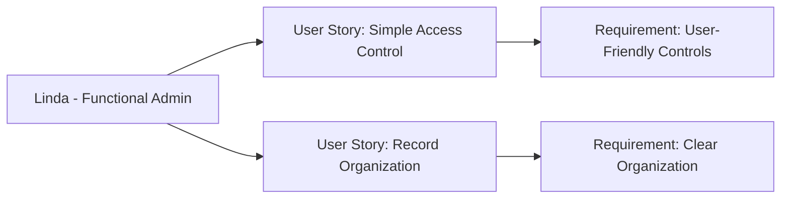

---
template:
  id: "user-persona"
  version: "1.0"
  category: "requirements"
  type: "user-research"
  parent: "base_template"

metadata:
  author: "Zebra MHH Team"
  version: "1.1"
  created: "2024-11-30"
  updated: "2024-11-30"
  status: "Draft"
  reviewers: 
    - "UX Lead"
    - "Patient Advocate"
    - "Clinical Advisor"

document:
  key: "PER-009-functional-admin"
  naming:
    pattern: "PER-009-functional_admin"
    prefix: "PER"
    sequence:
      format: "009"
    descriptor: "functional_admin"

ai:
  documentType: "user_persona"

# Functional Administrator

## Basic Information

| Field | Details |
|-------|---------|
| **Name** | Linda Morgan |
| **Age** | 41 |
| **Occupation** | Former Elementary School Teacher (now full-time caregiver) |
| **Location** | Atlanta, GA |
| **Education** | Bachelor's in Education |
| **Income Level** | Medium |
| **Family Status** | Married, two children (one with rare condition) |

## Profile Summary

Linda has become the functional administrator for her family's use of Zebra MHH, taking on this role out of necessity after her younger child was diagnosed with a rare condition. Without formal IT training, she has developed practical expertise in managing health information and access permissions through hands-on experience coordinating her child's complex care.

She serves as the primary organizer of the family's health information, managing provider access, maintaining health records, and ensuring information is properly shared with their care team. Her experience as an educator helps her approach system administration methodically, focusing on organizing information clearly and maintaining effective communication with healthcare providers.

## Technical Profile

| Aspect | Details |
|--------|---------|
| **Device Usage** | Medium |
| **Tech Comfort** | Basic to Intermediate |
| **Primary Devices** | iPad, Home laptop |
| **Frequently Used Apps** | - Organization: Calendar, Notes
- Healthcare: Patient portals
- Family: Photo organizer, File storage |
| **Digital Services** | - Family organizer apps
- Document management
- Basic health tracking tools |

## Goals and Needs

### Primary Goals

1. Manage healthcare provider access and information sharing in a simple, secure way that ensures the right doctors have the right information at the right time
2. Organize family health records and maintain clear documentation that can be easily shared with new healthcare providers

### Secondary Goals

1. Keep track of who has access to family health information
2. Maintain organized records of health data sharing and provider communications

## Pain Points and Frustrations

### Current Challenges

1. Permission Management: Understanding and managing different levels of access for various healthcare providers
2. Information Organization: Keeping health records organized and easily accessible for sharing

### Frustrations

1. Technical Complexity: Dealing with technical aspects of access management without technical background
2. Time Management: Balancing administrative tasks with caregiving responsibilities

## Preferences and Behaviors

### Communication Preferences

- Primary: Simple visual interfaces
- Secondary: Step-by-step guides
- Avoided: Technical jargon, complex procedures

### Decision-Making Factors

1. Simplicity: Needs straightforward, clear interfaces for managing access and organization
2. Support: Values readily available help and guidance for administrative tasks

## User Journey Scenarios
### Scenario 1: Provider Access Management
1. New Provider Setup
   - **Context**: Adding a new specialist to care team
   - **Actions**: 
     - Reviews provider credentials
     - Sets appropriate access level
     - Shares specific health records
     - Monitors initial access
   - **Pain Points**: 
     - Understanding access levels
     - Deciding what to share
     - Time constraints
   - **Desired Outcome**: Secure, appropriate access

2. Access Review
   - **Context**: Quarterly provider access audit
   - **Actions**:
     - Reviews active providers
     - Updates access permissions
     - Removes outdated access
     - Documents changes
   - **Success Metrics**:
     - Current access list
     - Updated permissions
     - Clean audit trail

### Scenario 2: Health Information Management
1. Record Organization
   - **Context**: Preparing for new provider consultation
   - **Actions**:
     - Updates health records
     - Organizes relevant documents
     - Sets sharing permissions
     - Notifies provider
   - **Requirements**:
     - Clear organization
     - Easy sharing
   - **Success Indicators**:
     - Complete information
     - Timely access

## Success Metrics
### Access Management
- **Provider Setup**:
  - Quick access setup
  - Clear permission levels
  - Easy monitoring

### Information Organization
- **Record Management**:
  - Efficient updates
  - Clear categorization
  - Simple sharing

### System Usage
- **Platform Management**:
  - Intuitive controls
  - Clear audit trails
  - Easy maintenance

## Platform Interaction Patterns
### Management Tasks
- **Access Control**:
  - Provider setup
  - Permission updates
  - Access monitoring
- **Record Management**:
  - Information updates
  - Document organization
  - Sharing control
- **System Maintenance**:
  - Regular reviews
  - Access cleanup
  - Audit checks

### Information Flow
- Provider access: As needed
- Record updates: Regular
- System checks: Scheduled
- Audits: Quarterly

## Requirements Traceability
### Related Documents
| Document Type | Reference ID | Description |
|--------------|--------------|-------------|
| User Story | US-020-access-management | Provider access control |
| User Story | US-021-record-organization | Health record management |
| Use Case | UC-015-provider-setup | New provider workflow |
| Use Case | UC-016-access-review | Regular audit process |

### Impact Analysis
| Target Area | Confidence Level | Notes |
|------------|------------------|-------|
| Access Control | 95% | Critical for security |
| Record Management | 90% | Essential for sharing |

### Supporting Documentation
- **Process Guides**: GUI-2024-001-Access-Management
- **Training Materials**: TRN-2024-005-Admin-Tasks
- **Additional References**: 
  - Access Control Guidelines
  - Record Management Best Practices
  - Audit Process Documentation

## Platform Requirements
### Essential Features
- **Priority**: Easy access management
- **Organization**: Clear record structure
- **Monitoring**: Simple audit tools

### Key Success Factors
1. Simplicity
   - Clear interfaces
   - Step-by-step guides
   - Visual feedback

2. Security
   - Permission levels
   - Access tracking
   - Audit trails

3. Support
   - Help resources
   - Task guidance
   - Error prevention

## User Stories

1. As Linda, I want to easily control which healthcare providers can see our family's health information, so I can ensure secure and appropriate sharing without needing technical expertise
2. As Linda, I want to maintain organized health records and manage provider access through simple interfaces, so I can focus on caregiving rather than technical administration

## Relationships and Dependencies

## Related Documentation
### EPICs:
- [Security and Compliance Epic](../02-User_Stories/EPIC-008-security-compliance.mdx)
- [Data Sharing and Collaboration Epic](../02-User_Stories/EPIC-004-data-sharing-collaboration.mdx)

### User Stories:
- [Emergency Access](../02-User_Stories/US-011-emergency-access.mdx)
- [Audit Logging](../02-User_Stories/US-017-audit-logging.mdx)

## Validation and Review

| Aspect | Status | Notes |
|--------|--------|-------|
| Usability Review | Pending | Focus on simplicity |
| Patient Review | Pending | Verify admin needs |
| Clinical Review | Pending | Confirm provider needs |
| Validation | Pending | Awaiting feedback |

## Change History

| Version | Date | Author | Changes |
|---------|------|--------|----------|
| 1.0 | 2024-11-30 | Zebra MHH Team | Initial persona creation |
| 1.1 | 2024-11-30 | Zebra MHH Team | Enhanced with user journeys, success metrics, interaction patterns, and platform requirements focused on patient/caregiver-centric access management |