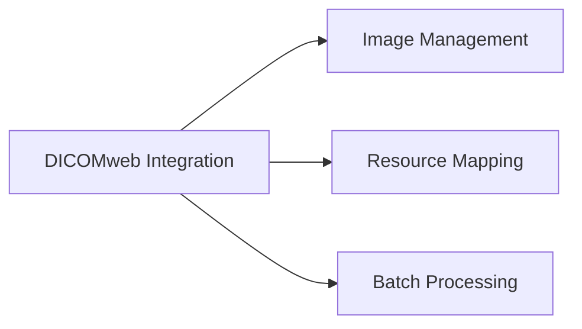

---
# Template Metadata
template:
  id: "use-case"
  version: "1.0"
  category: "requirements"
  type: "workflow"
  parent: "base_template"

# Document Metadata
metadata:
  author: "Zebra MHH Team"
  version: "1.0"
  created: "2024-01-08"
  updated: "2024-01-08"
  status: "Draft"
  reviewers: ["Technical Lead", "Clinical Advisor", "Imaging Specialist"]

# Document Identification
document:
  key: "UC-002-dicomweb-integration"
  naming:
    pattern: "UC-002-dicomweb_integration"
    prefix: "UC"
    sequence:
      format: "002"
    descriptor: "dicomweb_integration"

# Use Case: DICOMweb Integration

## Metadata
| Field | Value |
|-------|-------|
| **Use Case ID** | UC-002 |
| **Title** | DICOMweb Integration |
| **Actor** | Patient, Family Caregiver, Healthcare Provider, Imaging Specialist |
| **Scope** | System |
| **Level** | User-Goal |
| **Priority** | High |
| **Complexity** | High |

## Overview
This use case describes the process of integrating with DICOM imaging systems through DICOMweb protocols to import, store, and manage clinical images. It enables seamless integration with medical imaging systems while maintaining compliance with DICOM standards and proper image quality.

## Preconditions
1. User is authenticated and authorized in the system
2. DICOMweb server is operational and accessible
3. User has valid credentials for the imaging system
4. Required network connectivity is established
5. System has necessary DICOM configuration
6. Storage capacity is available for image data

## Basic Flow
1. User initiates clinical image import
2. System presents DICOMweb connection options:
   - Configured PACS systems
   - Hospital imaging servers
   - Custom DICOMweb endpoints
3. User selects imaging source
4. System establishes DICOMweb connection
5. System queries available studies/series:
   - QIDO-RS for search
   - Filter by date, modality, etc.
6. User selects images for import
7. System retrieves image data:
   - WADO-RS for image retrieval
   - Metadata extraction
8. System performs quality validation:
   - DICOM compliance check
   - Image integrity verification
   - Metadata completeness
9. System stores images in DICOM format:
   - STOW-RS for storage
   - Metadata preservation
10. System creates FHIR ImagingStudy resources
11. System links images to patient record
12. System confirms successful import

## Alternative Flows

### Alternative Flow 1: Custom DICOMweb Endpoint
**Trigger:** New imaging source configuration
1. User provides DICOMweb endpoint details
2. System validates endpoint compatibility
3. System tests connection parameters
4. Returns to main flow at step 4

### Alternative Flow 2: Bulk Image Import
**Trigger:** Multiple studies selected
1. System creates import queue
2. Processes images in background
3. Provides progress updates
4. Returns to main flow at step 8

### Alternative Flow 3: Image Series Update
**Trigger:** New images added to existing study
1. System detects new images
2. Validates against existing study
3. Updates study metadata
4. Returns to main flow at step 8

## Exception Flows

### Exception 1: Connection Failure
**Trigger:** Cannot connect to DICOMweb server
**Handling:**
1. System logs connection error
2. Attempts automatic retry
3. Provides manual retry option

### Exception 2: Image Quality Issues
**Trigger:** Image fails quality validation
**Handling:**
1. System identifies quality problems
2. Notifies user of issues
3. Provides correction options

## Postconditions
1. Clinical images are imported
2. DICOM data is properly stored
3. FHIR resources are created
4. Images are linked to patient
5. Import is logged for audit

## Business Rules
- All DICOM standards must be followed
- Image quality must be preserved
- Patient information must be protected
- Storage quotas must be respected
- Image access must be controlled
- FHIR-DICOM mapping must be maintained

## Special Requirements

### Performance Requirements
- Support large image datasets
- Quick thumbnail generation
- Efficient study browsing
- Background processing
- Concurrent user support

### Security Requirements
- Encrypted image transfer
- Access control enforcement
- Audit trail maintenance
- PHI protection
- Storage security

## Related Use Cases

## Validation and Review
| Aspect | Status | Notes |
|--------|--------|-------|
| Technical Review | Pending | Verify DICOM compliance |
| Clinical Review | Pending | Validate image quality |
| Security Review | Pending | Check PHI protection |
| Performance Review | Pending | Test large datasets |

## Change History
| Version | Date | Author | Changes |
|---------|------|--------|----------|
| 1.0 | 2024-01-08 | Zebra MHH Team | Initial creation |
