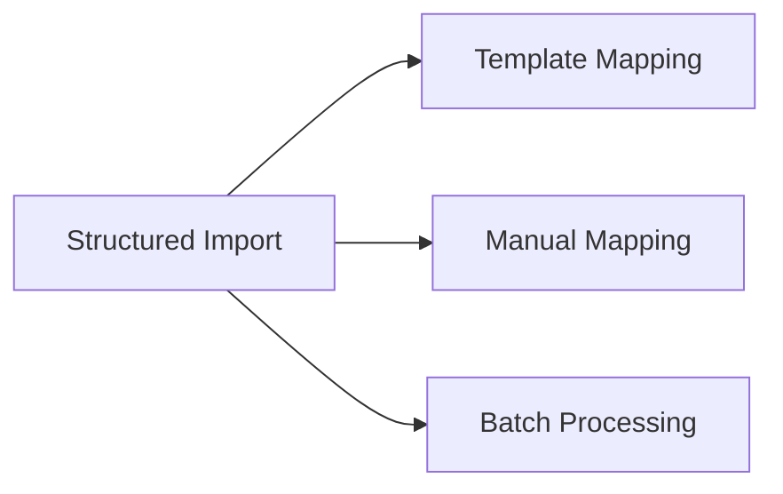

---
# Template Metadata
template:
  id: "use-case"
  version: "1.0"
  category: "requirements"
  type: "workflow"
  parent: "base_template"

# Document Metadata
metadata:
  author: "Zebra MHH Team"
  version: "1.0"
  created: "2024-01-08"
  updated: "2024-01-08"
  status: "Draft"
  reviewers: ["Technical Lead", "Data Architect", "Clinical Advisor"]

# Document Identification
document:
  key: "UC-003-structured-data-import"
  naming:
    pattern: "UC-003-structured_data_import"
    prefix: "UC"
    sequence:
      format: "003"
    descriptor: "structured_data_import"

# Use Case: Structured Data Import

## Metadata
| Field | Value |
|-------|-------|
| **Use Case ID** | UC-003 |
| **Title** | Structured Data Import (CSV/JSON) |
| **Actor** | Patient, Family Caregiver, Healthcare Data Manager |
| **Scope** | System |
| **Level** | User-Goal |
| **Priority** | High |
| **Complexity** | High |

## Overview
This use case describes the process of importing structured health data from CSV files and JSON documents, including the template-based mapping system for converting various data formats into FHIR-compliant resources. It supports both standard and custom data formats commonly used in healthcare systems and personal health devices.

## Preconditions
1. User is authenticated and authorized in the system
2. Structured data file is available in supported format (CSV, JSON)
3. Template engine is operational
4. Required mapping templates are available or can be created
5. Data validation services are accessible
6. Storage capacity is available

## Basic Flow
1. User initiates structured data import
2. System presents import options:
   - CSV file upload
   - JSON file upload
   - Template selection/creation
3. User uploads data file(s)
4. System analyzes file structure:
   - Format validation
   - Schema detection
   - Column/field identification
   - Data type inference
5. System suggests mapping approach:
   - Matching existing templates
   - Similar templates for adaptation
   - New template creation
6. User configures mapping:
   - Selects/creates template
   - Maps fields to FHIR resources
   - Defines transformations
   - Sets validation rules
7. System performs sample mapping
8. User reviews sample results:
   - Validates field mappings
   - Adjusts transformations
   - Configures error handling
9. System executes full import:
   - Applies mappings
   - Performs validations
   - Creates FHIR resources
10. System presents import results:
    - Success/failure statistics
    - Validation warnings
    - Error details
11. User reviews and confirms import
12. System saves imported resources

## Alternative Flows

### Alternative Flow 1: Template Creation
**Trigger:** No suitable template exists
1. User initiates template creation
2. System guides through template definition:
   - Field identification
   - FHIR resource mapping
   - Transformation rules
   - Validation criteria
3. User saves template
4. Returns to main flow at step 7

### Alternative Flow 2: Custom Format
**Trigger:** Non-standard data format
1. User specifies custom format
2. System analyzes structure
3. Creates custom parser
4. Returns to main flow at step 5

### Alternative Flow 3: Batch Processing
**Trigger:** Multiple files selected
1. System validates all files
2. Creates processing queue
3. Executes batch import
4. Returns to main flow at step 9

## Exception Flows

### Exception 1: Invalid Structure
**Trigger:** File structure validation fails
**Handling:**
1. System identifies issues
2. Suggests corrections
3. Allows format adjustment

### Exception 2: Mapping Errors
**Trigger:** Data mapping fails
**Handling:**
1. System logs errors
2. Highlights problem areas
3. Enables manual correction

## Postconditions
1. Data is imported as FHIR resources
2. Mapping template is saved/updated
3. Import results are logged
4. Data lineage is maintained
5. Validation report is generated

## Business Rules
- All mappings must be reversible
- Templates must be version controlled
- Data validation rules must be configurable
- Field mappings must be documented
- Data quality must be maintained
- Error thresholds must be defined

## Special Requirements

### Performance Requirements
- Template matching < 2 seconds
- Sample processing < 5 seconds
- Support files up to 100MB
- Concurrent import support
- Real-time validation

### Security Requirements
- Secure template storage
- Data validation logging
- Access control for templates
- PHI protection
- Error log sanitization

## Related Use Cases

## Validation and Review
| Aspect | Status | Notes |
|--------|--------|-------|
| Technical Review | Pending | Verify mapping engine |
| Data Review | Pending | Check transformations |
| Clinical Review | Pending | Validate terminology |
| Performance Review | Pending | Test large datasets |

## Change History
| Version | Date | Author | Changes |
|---------|------|--------|----------|
| 1.0 | 2024-01-08 | Zebra MHH Team | Initial creation |
