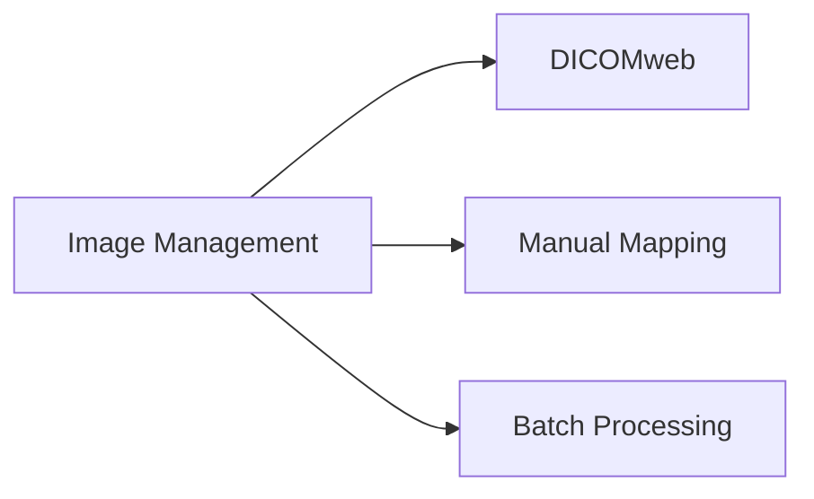

---
# Template Metadata
template:
  id: "use-case"
  version: "1.0"
  category: "requirements"
  type: "workflow"
  parent: "base_template"

# Document Metadata
metadata:
  author: "Zebra MHH Team"
  version: "1.0"
  created: "2024-01-08"
  updated: "2024-01-08"
  status: "Draft"
  reviewers: ["Technical Lead", "Imaging Specialist", "Clinical Advisor"]

# Document Identification
document:
  key: "UC-005-clinical-image-management"
  naming:
    pattern: "UC-005-clinical_image_management"
    prefix: "UC"
    sequence:
      format: "005"
    descriptor: "clinical_image_management"

# Use Case: Clinical Image Import and Management

## Metadata
| Field | Value |
|-------|-------|
| **Use Case ID** | UC-005 |
| **Title** | Clinical Image Import and Management |
| **Actor** | Patient, Family Caregiver, Healthcare Provider |
| **Scope** | System |
| **Level** | User-Goal |
| **Priority** | High |
| **Complexity** | High |

## Overview
This use case describes the process of importing and managing clinical images from various sources, including direct uploads and third-party systems. It covers image organization, metadata management, DICOM compliance, and integration with FHIR resources, ensuring proper medical image handling and accessibility.

## Preconditions
1. User is authenticated and authorized in the system
2. Clinical images are available for import
3. DICOM services are operational
4. Storage system is available
5. Required metadata is accessible
6. Image viewer components are ready

## Basic Flow
1. User initiates image import
2. System presents import options:
   - Direct file upload
   - Third-party system import
   - Folder/batch import
3. User selects images/source
4. System analyzes images:
   - Format validation
   - DICOM compliance check
   - Metadata extraction
   - Quality assessment
5. System processes metadata:
   - Patient information
   - Study details
   - Series information
   - Acquisition parameters
6. User reviews and confirms:
   - Image quality
   - Metadata accuracy
   - Study organization
7. System processes images:
   - DICOM conversion if needed
   - Thumbnail generation
   - Series organization
8. System creates resources:
   - DICOM objects
   - FHIR ImagingStudy
   - Related resources
9. User organizes studies:
   - Assigns categories
   - Sets relationships
   - Adds annotations
10. System finalizes import:
    - Stores images
    - Updates indexes
    - Creates links
11. System enables access:
    - Viewer integration
    - Search capability
    - Access controls

## Alternative Flows

### Alternative Flow 1: Non-DICOM Import
**Trigger:** Non-DICOM image format
1. System converts to DICOM
2. Generates required metadata
3. Creates DICOM objects
4. Returns to main flow at step 5

### Alternative Flow 2: Study Update
**Trigger:** Adding to existing study
1. System matches study
2. Validates compatibility
3. Merges metadata
4. Returns to main flow at step 7

### Alternative Flow 3: Bulk Import
**Trigger:** Multiple studies selected
1. System creates import queue
2. Processes in background
3. Updates progressively
4. Returns to main flow at step 8

## Exception Flows

### Exception 1: Invalid Format
**Trigger:** Unsupported image format
**Handling:**
1. System notifies format issue
2. Suggests alternatives
3. Offers conversion options

### Exception 2: Metadata Mismatch
**Trigger:** Inconsistent metadata
**Handling:**
1. System flags discrepancies
2. Requests clarification
3. Allows manual correction

## Postconditions
1. Images are properly stored
2. DICOM objects are created
3. FHIR resources are linked
4. Access is configured
5. Import is logged

## Business Rules
- DICOM compliance required
- Patient matching verified
- Study organization maintained
- Image quality preserved
- Access controls enforced
- Audit trail maintained

## Special Requirements

### Performance Requirements
- Quick thumbnail generation
- Efficient study browsing
- Fast image retrieval
- Background processing
- Multi-user support

### Security Requirements
- PHI protection
- Access logging
- Storage encryption
- Transfer security
- Viewer security

## Related Use Cases

## Validation and Review
| Aspect | Status | Notes |
|--------|--------|-------|
| Technical Review | Pending | Check DICOM compliance |
| Clinical Review | Pending | Verify image quality |
| Security Review | Pending | Validate PHI handling |
| Performance Review | Pending | Test large studies |

## Change History
| Version | Date | Author | Changes |
|---------|------|--------|----------|
| 1.0 | 2024-01-08 | Zebra MHH Team | Initial creation |
