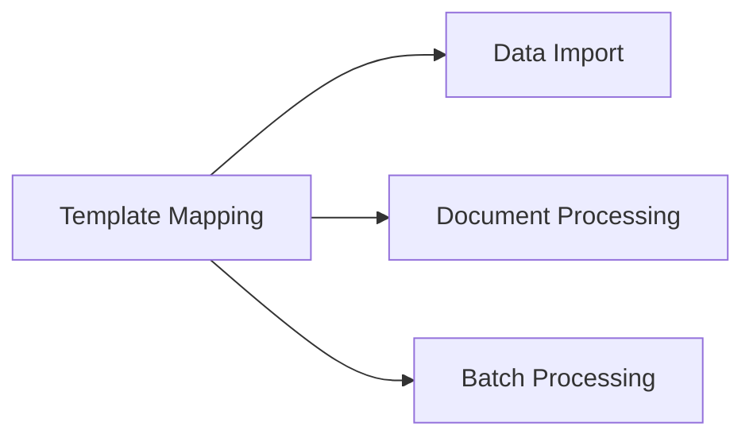

---
# Template Metadata
template:
  id: "use-case"
  version: "1.0"
  category: "requirements"
  type: "workflow"
  parent: "base_template"

# Document Metadata
metadata:
  author: "Zebra MHH Team"
  version: "1.0"
  created: "2024-01-08"
  updated: "2024-01-08"
  status: "Draft"
  reviewers: ["Technical Lead", "Data Architect"]

# Document Identification
document:
  key: "UC-006-template-resource-mapping"
  naming:
    pattern: "UC-006-template_resource_mapping"
    prefix: "UC"
    sequence:
      format: "006"
    descriptor: "template_resource_mapping"

# Use Case: Template-Based Resource Mapping

## Metadata
| Field | Value |
|-------|-------|
| **Use Case ID** | UC-006 |
| **Title** | Template-Based Resource Mapping |
| **Actor** | Healthcare Data Manager, System Administrator |
| **Scope** | System |
| **Level** | User-Goal |
| **Priority** | High |
| **Complexity** | High |

## Overview
This use case describes the process of creating, managing, and applying templates for mapping various data formats to FHIR resources. It enables standardized transformation of health data through configurable mapping rules and validation criteria.

## Preconditions
1. User is authenticated with template management privileges
2. Template engine is operational
3. FHIR resource definitions are available
4. Test data is available for validation
5. Required terminology services are accessible

## Basic Flow
1. User initiates template management
2. System displays template options:
   - Create new template
   - Modify existing template
   - Clone template
   - Import template
3. User selects template action
4. System presents template editor:
   - Source format definition
   - FHIR resource selection
   - Field mapping interface
   - Transformation rules
   - Validation criteria
5. User configures template:
   - Maps source fields to FHIR elements
   - Defines data transformations
   - Sets validation rules
   - Configures error handling
6. System validates template:
   - Syntax checking
   - FHIR compliance
   - Transformation logic
7. User tests template:
   - Selects test data
   - Reviews mapping results
   - Verifies transformations
8. System processes test results:
   - Validates output
   - Reports issues
   - Suggests optimizations
9. User refines template:
   - Adjusts mappings
   - Updates rules
   - Fixes issues
10. System saves template:
    - Versions template
    - Updates registry
    - Generates documentation

## Alternative Flows

### Alternative Flow 1: Template Import
**Trigger:** External template available
1. User imports template file
2. System validates format
3. Adapts to local configuration
4. Returns to main flow at step 6

### Alternative Flow 2: Template Cloning
**Trigger:** Similar template needed
1. User selects source template
2. System creates copy
3. User modifies copy
4. Returns to main flow at step 5

### Alternative Flow 3: Batch Testing
**Trigger:** Multiple test cases needed
1. User provides test dataset
2. System runs batch test
3. Generates test report
4. Returns to main flow at step 8

## Exception Flows

### Exception 1: Validation Failure
**Trigger:** Template fails validation
**Handling:**
1. System identifies issues
2. Provides error details
3. Suggests corrections

### Exception 2: Incompatible Format
**Trigger:** Source format mismatch
**Handling:**
1. System flags incompatibility
2. Shows format requirements
3. Guides adaptation

## Postconditions
1. Template is created/updated
2. Documentation is generated
3. Tests are completed
4. Version is recorded
5. Template is deployable

## Business Rules
- Templates must be version controlled
- All mappings must be documented
- Test coverage required
- FHIR compliance mandatory
- Error handling defined
- Reusability promoted

## Special Requirements

### Performance Requirements
- Template validation < 5 seconds
- Test execution < 30 seconds
- Editor response < 1 second
- Multiple format support
- Concurrent editing

### Security Requirements
- Template access control
- Version protection
- Audit logging
- Test data security
- Documentation control

## Related Use Cases

## Validation and Review
| Aspect | Status | Notes |
|--------|--------|-------|
| Technical Review | Pending | Verify mapping engine |
| FHIR Review | Pending | Check compliance |
| Performance Review | Pending | Test large templates |
| Security Review | Pending | Validate access control |

## Change History
| Version | Date | Author | Changes |
|---------|------|--------|----------|
| 1.0 | 2024-01-08 | Zebra MHH Team | Initial creation |
