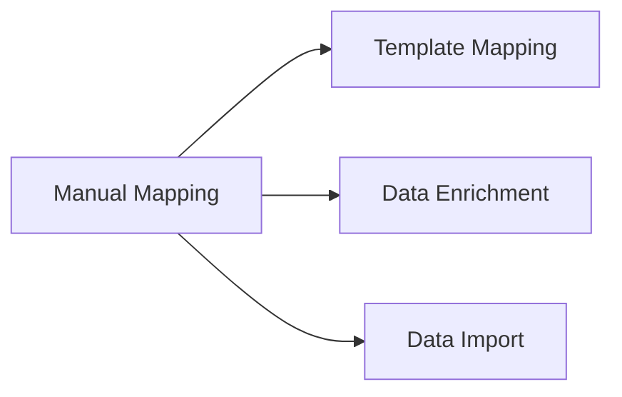

---
# Template Metadata
template:
  id: "use-case"
  version: "1.0"
  category: "requirements"
  type: "workflow"
  parent: "base_template"

# Document Metadata
metadata:
  author: "Zebra MHH Team"
  version: "1.0"
  created: "2024-01-08"
  updated: "2024-01-08"
  status: "Draft"
  reviewers: ["Technical Lead", "Clinical Advisor"]

# Document Identification
document:
  key: "UC-007-manual-resource-mapping"
  naming:
    pattern: "UC-007-manual_resource_mapping"
    prefix: "UC"
    sequence:
      format: "007"
    descriptor: "manual_resource_mapping"

# Use Case: Manual Resource Mapping and Validation

## Metadata
| Field | Value |
|-------|-------|
| **Use Case ID** | UC-007 |
| **Title** | Manual Resource Mapping and Validation |
| **Actor** | Healthcare Data Manager, Clinical Data Specialist |
| **Scope** | System |
| **Level** | User-Goal |
| **Priority** | High |
| **Complexity** | Medium |

## Overview
This use case describes the process of manually mapping and validating health data to FHIR resources when automated processes require human intervention or verification. It provides tools for direct manipulation and validation of resource mappings while maintaining data quality and compliance.

## Preconditions
1. User is authenticated with mapping privileges
2. Source data is accessible
3. FHIR resource definitions are available
4. Validation services are operational
5. Required terminology services are accessible

## Basic Flow
1. User initiates manual mapping
2. System presents mapping interface:
   - Source data view
   - FHIR resource browser
   - Mapping workspace
   - Validation tools
3. User selects source content:
   - Highlights data elements
   - Identifies relationships
   - Notes special cases
4. System suggests mappings:
   - Resource types
   - Field matches
   - Terminology codes
5. User performs mapping:
   - Confirms/adjusts suggestions
   - Creates new mappings
   - Sets relationships
   - Adds annotations
6. System validates in real-time:
   - FHIR compliance
   - Required fields
   - Data types
   - Value sets
7. User reviews validation:
   - Addresses issues
   - Adds justifications
   - Documents decisions
8. System creates resources:
   - Generates FHIR JSON
   - Maintains relationships
   - Records provenance
9. User performs final review
10. System saves resources

## Alternative Flows

### Alternative Flow 1: Partial Mapping
**Trigger:** Incomplete source data
1. User marks missing elements
2. Sets placeholder values
3. Flags for follow-up
4. Returns to main flow at step 8

### Alternative Flow 2: Complex Mapping
**Trigger:** Non-standard data relationships
1. User creates custom mappings
2. Defines transformations
3. Documents approach
4. Returns to main flow at step 6

### Alternative Flow 3: Bulk Validation
**Trigger:** Multiple related mappings
1. User groups mappings
2. System validates set
3. Shows relationships
4. Returns to main flow at step 7

## Exception Flows

### Exception 1: Validation Error
**Trigger:** FHIR compliance issue
**Handling:**
1. System highlights error
2. Provides guidance
3. Allows override with justification

### Exception 2: Terminology Mismatch
**Trigger:** Code lookup failure
**Handling:**
1. System suggests alternatives
2. Enables manual entry
3. Records decision

## Postconditions
1. Resources are mapped
2. Validation is complete
3. Documentation is updated
4. Provenance is recorded
5. Resources are available

## Business Rules
- All mappings must be justified
- Validation exceptions documented
- FHIR compliance required
- Terminology binding enforced
- Provenance maintained
- Audit trail required

## Special Requirements

### Performance Requirements
- Real-time validation
- Quick terminology lookup
- Responsive interface
- Multi-resource support
- Undo/redo capability

### Security Requirements
- Action logging
- Decision tracking
- Access control
- Data protection
- Audit support

## Related Use Cases

## Validation and Review
| Aspect | Status | Notes |
|--------|--------|-------|
| Technical Review | Pending | Check validation rules |
| Clinical Review | Pending | Verify accuracy |
| UX Review | Pending | Test usability |
| Security Review | Pending | Verify logging |

## Change History
| Version | Date | Author | Changes |
|---------|------|--------|----------|
| 1.0 | 2024-01-08 | Zebra MHH Team | Initial creation |
