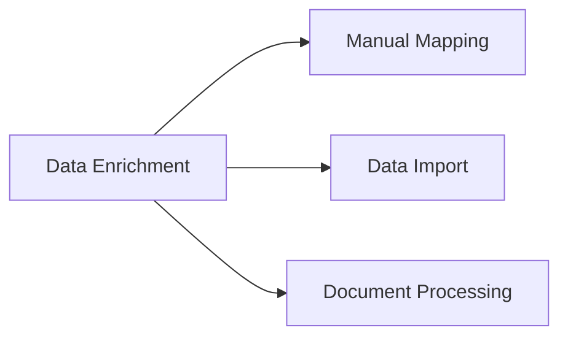

---
# Template Metadata
template:
  id: "use-case"
  version: "1.0"
  category: "requirements"
  type: "workflow"
  parent: "base_template"

# Document Metadata
metadata:
  author: "Zebra MHH Team"
  version: "1.0"
  created: "2024-01-08"
  updated: "2024-01-08"
  status: "Draft"
  reviewers: ["Technical Lead", "Clinical Advisor", "Terminology Specialist"]

# Document Identification
document:
  key: "UC-008-data-enrichment"
  naming:
    pattern: "UC-008-data_enrichment"
    prefix: "UC"
    sequence:
      format: "008"
    descriptor: "data_enrichment"

# Use Case: Data Enrichment and Terminology Mapping

## Metadata
| Field | Value |
|-------|-------|
| **Use Case ID** | UC-008 |
| **Title** | Data Enrichment and Terminology Mapping |
| **Actor** | Healthcare Data Manager, Clinical Data Specialist |
| **Scope** | System |
| **Level** | User-Goal |
| **Priority** | High |
| **Complexity** | High |

## Overview
This use case describes the process of enriching health data through terminology mapping, NER, and reference data integration. It enables the standardization and enhancement of medical information using established terminologies (SNOMED CT, LOINC, ICD-10) and AI-assisted analysis.

## Preconditions
1. User is authenticated with enrichment privileges
2. Source data is mapped to FHIR resources
3. Terminology services are available
4. NER services are operational
5. Reference data is accessible
6. AI models are trained and available

## Basic Flow
1. User initiates data enrichment
2. System analyzes content:
   - Medical term identification
   - Context analysis
   - Relationship detection
3. System suggests enrichments:
   - SNOMED CT codes
   - LOINC codes
   - ICD-10 codes
   - Related concepts
4. User reviews suggestions:
   - Validates terms
   - Confirms codes
   - Adjusts relationships
5. System performs NER:
   - Entity extraction
   - Attribute identification
   - Reference matching
6. User validates entities:
   - Confirms matches
   - Resolves ambiguities
   - Adds missing entities
7. System links references:
   - Body systems
   - Medical concepts
   - Related resources
8. User reviews enrichment:
   - Verifies accuracy
   - Adds annotations
   - Documents decisions
9. System updates resources:
   - Adds terminology
   - Links references
   - Records provenance
10. User performs final review
11. System saves enriched data

## Alternative Flows

### Alternative Flow 1: Manual Enrichment
**Trigger:** Missing automatic matches
1. User searches terminology
2. Selects appropriate codes
3. Adds manual annotations
4. Returns to main flow at step 7

### Alternative Flow 2: Batch Enrichment
**Trigger:** Multiple similar items
1. User groups items
2. System processes batch
3. Shows group results
4. Returns to main flow at step 4

### Alternative Flow 3: Reference Update
**Trigger:** New reference data available
1. System detects updates
2. Suggests reprocessing
3. Updates references
4. Returns to main flow at step 7

## Exception Flows

### Exception 1: Terminology Service Error
**Trigger:** Service unavailable
**Handling:**
1. System uses cached data
2. Flags for update
3. Enables manual entry

### Exception 2: Ambiguous Mapping
**Trigger:** Multiple possible matches
**Handling:**
1. System presents options
2. User selects correct match
3. Documents decision

## Postconditions
1. Data is enriched
2. Terminology is mapped
3. References are linked
4. Provenance is recorded
5. Resources are updated

## Business Rules
- Terminology versions tracked
- All mappings validated
- Reference links maintained
- Decisions documented
- Updates versioned
- Audit trail required

## Special Requirements

### Performance Requirements
- Quick term lookup
- Batch processing support
- Real-time suggestions
- Efficient caching
- Version control

### Security Requirements
- Terminology access control
- Update logging
- Decision tracking
- Data protection
- Audit support

## Related Use Cases

## Validation and Review
| Aspect | Status | Notes |
|--------|--------|-------|
| Technical Review | Pending | Check terminology services |
| Clinical Review | Pending | Verify accuracy |
| AI Review | Pending | Validate NER |
| Security Review | Pending | Check access control |

## Change History
| Version | Date | Author | Changes |
|---------|------|--------|----------|
| 1.0 | 2024-01-08 | Zebra MHH Team | Initial creation |
