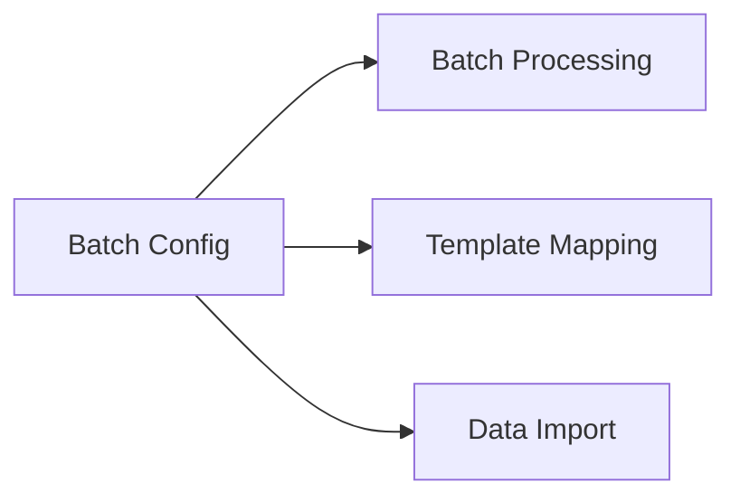

---
# Template Metadata
template:
  id: "use-case"
  version: "1.0"
  category: "requirements"
  type: "workflow"
  parent: "base_template"

# Document Metadata
metadata:
  author: "Zebra MHH Team"
  version: "1.0"
  created: "2024-01-08"
  updated: "2024-01-08"
  status: "Draft"
  reviewers: ["Technical Lead", "System Architect"]

# Document Identification
document:
  key: "UC-009-batch-import-config"
  naming:
    pattern: "UC-009-batch_import_config"
    prefix: "UC"
    sequence:
      format: "009"
    descriptor: "batch_import_config"

# Use Case: Batch Import Configuration

## Metadata
| Field | Value |
|-------|-------|
| **Use Case ID** | UC-009 |
| **Title** | Batch Import Configuration |
| **Actor** | Healthcare Data Manager, System Administrator |
| **Scope** | System |
| **Level** | User-Goal |
| **Priority** | High |
| **Complexity** | High |

## Overview
This use case describes the process of configuring and managing batch import operations for processing large volumes of health data. It enables efficient handling of multiple files and resources while maintaining data quality and system performance.

## Preconditions
1. User is authenticated with batch configuration privileges
2. Import templates are available
3. Processing resources are available
4. Storage capacity is sufficient
5. Monitoring tools are operational

## Basic Flow
1. User initiates batch configuration
2. System presents configuration options:
   - Source selection
   - Template assignment
   - Processing rules
   - Error handling
   - Resource allocation
3. User defines batch scope:
   - File patterns
   - Directory structures
   - Resource types
   - Priority levels
4. System analyzes requirements:
   - Storage needs
   - Processing capacity
   - Time estimates
5. User configures processing:
   - Parallel processing
   - Resource limits
   - Validation rules
   - Error thresholds
6. System validates configuration:
   - Resource availability
   - Template compatibility
   - Rule consistency
7. User sets monitoring:
   - Progress tracking
   - Error reporting
   - Notification rules
8. System creates batch profile:
   - Saves configuration
   - Generates ID
   - Sets schedule
9. User reviews settings
10. System activates profile

## Alternative Flows

### Alternative Flow 1: Template Assignment
**Trigger:** Multiple templates needed
1. User maps templates to patterns
2. System validates mappings
3. Creates template chain
4. Returns to main flow at step 6

### Alternative Flow 2: Resource Optimization
**Trigger:** Performance constraints
1. User adjusts resources
2. System recalculates estimates
3. Updates configuration
4. Returns to main flow at step 6

### Alternative Flow 3: Schedule Configuration
**Trigger:** Timing requirements
1. User sets schedule
2. System checks conflicts
3. Reserves resources
4. Returns to main flow at step 8

## Exception Flows

### Exception 1: Resource Conflict
**Trigger:** Insufficient resources
**Handling:**
1. System shows constraints
2. Suggests alternatives
3. Allows reallocation

### Exception 2: Template Mismatch
**Trigger:** Incompatible templates
**Handling:**
1. System identifies conflicts
2. Provides resolution options
3. Guides adjustment

## Postconditions
1. Batch profile is created
2. Resources are allocated
3. Monitoring is configured
4. Schedule is set
5. Profile is ready

## Business Rules
- Resource limits enforced
- Error thresholds defined
- Templates validated
- Schedules coordinated
- Monitoring required
- Audit trail maintained

## Special Requirements

### Performance Requirements
- Configuration response < 2s
- Resource calculation < 5s
- Template validation < 3s
- Profile activation < 1s
- Multi-user support

### Security Requirements
- Profile access control
- Resource protection
- Configuration versioning
- Audit logging
- Error tracking

## Related Use Cases

## Validation and Review
| Aspect | Status | Notes |
|--------|--------|-------|
| Technical Review | Pending | Check resource management |
| Performance Review | Pending | Verify scalability |
| Security Review | Pending | Validate access control |
| Operations Review | Pending | Test monitoring |

## Change History
| Version | Date | Author | Changes |
|---------|------|--------|----------|
| 1.0 | 2024-01-08 | Zebra MHH Team | Initial creation |
