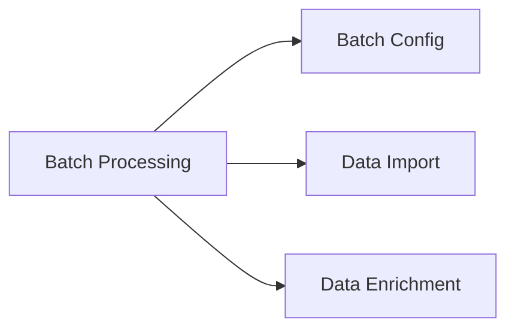

---
# Template Metadata
template:
  id: "use-case"
  version: "1.0"
  category: "requirements"
  type: "workflow"
  parent: "base_template"

# Document Metadata
metadata:
  author: "Zebra MHH Team"
  version: "1.0"
  created: "2024-01-08"
  updated: "2024-01-08"
  status: "Draft"
  reviewers: ["Technical Lead", "Operations Lead"]

# Document Identification
document:
  key: "UC-010-batch-processing"
  naming:
    pattern: "UC-010-batch_processing"
    prefix: "UC"
    sequence:
      format: "010"
    descriptor: "batch_processing"

# Use Case: Batch Processing Execution

## Metadata
| Field | Value |
|-------|-------|
| **Use Case ID** | UC-010 |
| **Title** | Batch Processing Execution |
| **Actor** | Healthcare Data Manager, System Administrator |
| **Scope** | System |
| **Level** | User-Goal |
| **Priority** | High |
| **Complexity** | High |

## Overview
This use case describes the process of executing and managing batch processing operations for health data import and conversion. It handles the actual processing of configured batch jobs, including monitoring, error handling, and results management.

## Preconditions
1. User is authenticated with batch execution privileges
2. Batch profile is configured
3. Required resources are available
4. Source data is accessible
5. Monitoring systems are active

## Basic Flow
1. User initiates batch execution
2. System validates readiness:
   - Resource availability
   - Data accessibility
   - Template status
   - System health
3. System initializes processing:
   - Creates job queue
   - Allocates resources
   - Sets up monitoring
4. System begins execution:
   - Loads data
   - Applies templates
   - Processes items
   - Tracks progress
5. User monitors execution:
   - Views progress
   - Checks statistics
   - Reviews errors
6. System manages resources:
   - Balances load
   - Handles failures
   - Adjusts throughput
7. System processes results:
   - Validates output
   - Generates reports
   - Updates status
8. User reviews progress:
   - Checks completion
   - Reviews errors
   - Verifies results
9. System finalizes batch:
   - Saves results
   - Cleans resources
   - Updates logs
10. User confirms completion

## Alternative Flows

### Alternative Flow 1: Pause Processing
**Trigger:** Resource constraint
1. User pauses execution
2. System completes current items
3. Preserves state
4. Returns to main flow at step 4

### Alternative Flow 2: Error Recovery
**Trigger:** Processing errors
1. System identifies failures
2. Isolates affected items
3. Continues processing
4. Returns to main flow at step 4

### Alternative Flow 3: Priority Override
**Trigger:** Urgent item needed
1. User marks priority items
2. System reorders queue
3. Processes priority items
4. Returns to main flow at step 4

## Exception Flows

### Exception 1: System Overload
**Trigger:** Resource exhaustion
**Handling:**
1. System throttles processing
2. Notifies administrators
3. Maintains stability

### Exception 2: Data Access Error
**Trigger:** Source unavailable
**Handling:**
1. System retries access
2. Logs failures
3. Continues available items

## Postconditions
1. Batch is processed
2. Results are saved
3. Resources are released
4. Logs are updated
5. Reports are available

## Business Rules
- Resource limits respected
- Error thresholds enforced
- Results validated
- State preserved
- Audit trail maintained
- Notifications required

## Special Requirements

### Performance Requirements
- Queue management < 1s
- Status updates < 5s
- Resource adjustment < 2s
- Error handling < 3s
- Concurrent processing

### Security Requirements
- Process isolation
- Data protection
- Access control
- Audit logging
- Error tracking

## Related Use Cases

## Validation and Review
| Aspect | Status | Notes |
|--------|--------|-------|
| Technical Review | Pending | Check processing engine |
| Performance Review | Pending | Test throughput |
| Security Review | Pending | Verify isolation |
| Operations Review | Pending | Validate monitoring |

## Change History
| Version | Date | Author | Changes |
|---------|------|--------|----------|
| 1.0 | 2024-01-08 | Zebra MHH Team | Initial creation |
