# AI-Friendly Specification Templates

Welcome! This guide will help you create professional documentation using our AI-powered template system. Whether you're working with **templates** or generating **specifications** from these templates, our smart system will guide you through the process.

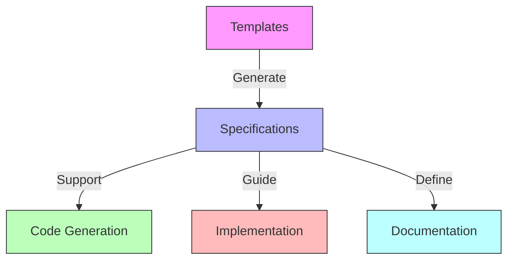

## Table of Contents

1. [Introduction](#1-introduction)
2. [Key Definitions](#2-key-definitions)
3. [Getting Started](#3-getting-started)
   - 3.1 [Understand the Basics](#31-understand-the-basics)
   - 3.2 [Project Organization](#32-project-organization)
   - 3.3 [Understanding Template Structure](#33-understanding-template-structure)
   - 3.4 [Template Selection and Usage](#34-template-selection-and-usage)
   - 3.5 [Working with AI Tools](#35-working-with-ai-tools)
4. [Roles and Best Practices](#4-roles-and-best-practices)
   - 4.1 [Roles and Responsibilities](#41-roles-and-responsibilities)
   - 4.2 [Best Practices](#42-best-practices)
5. [Template Customization and Maintenance](#5-template-customization-and-maintenance)
6. [Reference Materials](#6-reference-materials)
7. [Support Documents](#7-support-documents)

---

## 1. Introduction

Our **AI-friendly specification templates** are designed to streamline the process of creating clear, consistent, and comprehensive documentation for your projects. By leveraging AI assistance, you can efficiently generate specifications, maintain consistency across documents, and ensure that all necessary information is included.

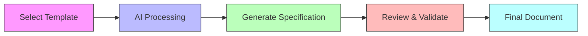

The generated specifications, which are "live" and "iterative," can be used as input for AI assistants or tools to generate code, scripts, and more for your software project. Conversely, if you have developed code without any specification, you can use these templates as a reference to infer the specifications that your code is using and document it.

## 2. Key Definitions

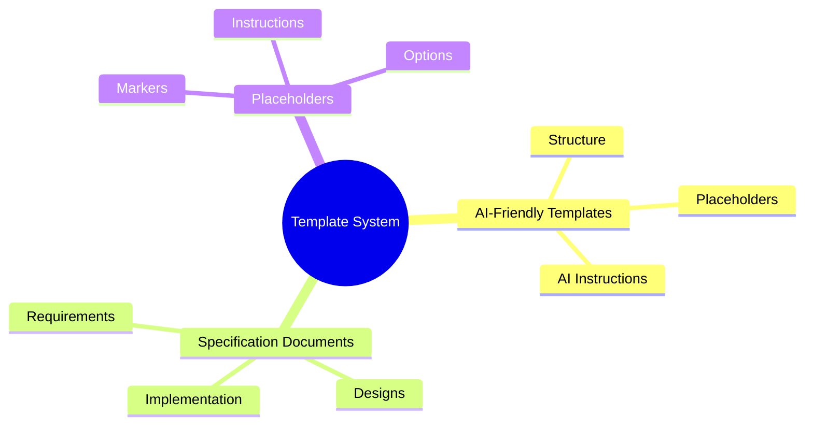

Before we dive in, let's define some key terms that will be used throughout this guide:

- **AI-Friendly Specification Template**: A structured document that includes placeholders and AI instructions to guide the creation of a specification. These templates are designed to be AI-friendly, allowing the AI assistant to understand and process them effectively. They serve as a bridge between human input and AI processing, facilitating the collaborative creation of specifications.

- **Specification Document**: A detailed document generated from a template that outlines specific aspects of a project, such as requirements, designs, or implementation details. The specification serves as a definitive guide for stakeholders and team members.

- **Placeholder**: A marker within a template that indicates where specific information should be inserted. Placeholders often have a specific syntax (e.g., `${PLACEHOLDER_NAME}`) and may include instructions or options for the content to be provided, to be reviewed, make suggestions, or approve them.

## 3. Getting Started

### 3.1 Understand the Basics

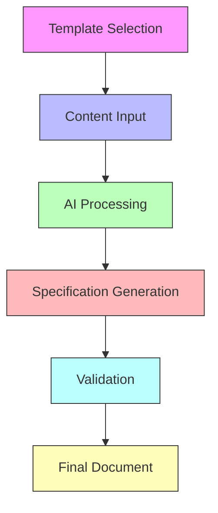

Before you begin, it's essential to grasp how the AI-friendly specification templates and specification documents work together:

- **Specifications Templates** are the starting point. They contain the structure, placeholders, and AI instructions necessary for generating the project specification documents.

- **Specifications Documents** are the final documents you produce by filling in the templates, usually with the assistance of an AI assistant or AI-powered IDE or tool.

- **AI Assistance** helps you fill in the templates, ensuring completeness and consistency.

### 3.2 Project Organization

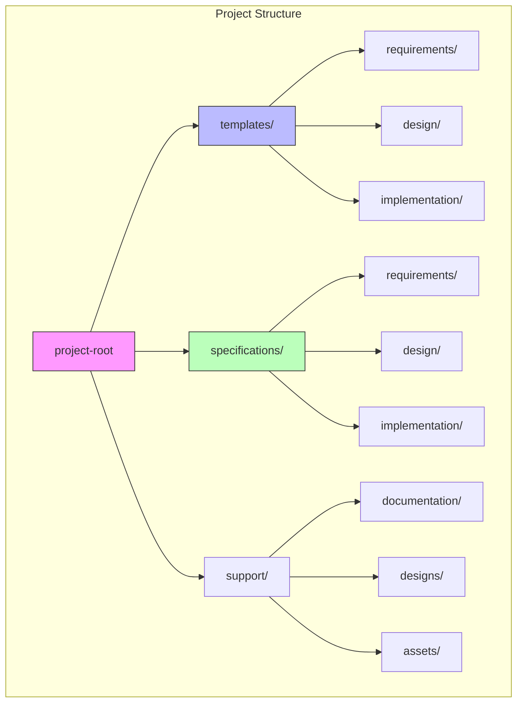

Set up your project with a clear folder structure:


```
your-project/
├── templates/                  # AI-friendly specification templates
│   ├── requirements/           # Requirements templates
│   │   ├── core/
│   │   ├── personas-roles/
│   │   ├── glossary/
│   │   ├── user-stories/
│   │   ├── use-cases/
│   │   ├── functional/
│   │   ├── non-functional/
│   │   └── technical/
│   ├── design/                 # Design templates
│   │   ├── architecture/
│   │   ├── database/
│   │   ├── integrations/
│   │   ├── ui-ux/
│   │   └── security/
│   ├── implementation/         # Implementation templates
│   │   ├── development/        # Development templates
│   │   ├── deployment/         # Deployment templates
│   │   └── testing/            # Testing templates
├── specifications/             # Generated specifications
│   ├── requirements/           # Generated requirements specifications
│   │   ├── core/
│   │   ├── personas-roles/
│   │   ├── glossary/
│   │   ├── user-stories/
│   │   ├── use-cases/
│   │   ├── functional/
│   │   ├── non-functional/
│   │   └── technical/
│   ├── design/                 # Generated design specifications
│   │   ├── architecture/
│   │   ├── database/
│   │   ├── integrations/
│   │   ├── ui-ux/
│   │   └── security/
│   ├── implementation/         # Generated implementation specifications
│   │   ├── development/        # Generated development specifications
│   │   ├── deployment/         # Generated deployment specifications
│   │   └── testing/            # Generated testing specifications
├── support/                    # Project-specific support documents
│   ├── documentation/          # Online docs and guidelines
│   ├── designs/                # Design files and references
│   └── assets/                 # Images, logos, and other media
└── .cursorrules                # AI processing rules
```

Key directories:
- **templates/**: Contains your AI-friendly specification templates
- **specifications/**: Contains the generated specification documents
- **support/**: Holds project-specific resources that aid in generating specifications
  - **documentation/**: Online documentation references or guidelines
  - **designs/**: Design files (e.g., sketches, wireframes) that the AI can analyze for style inference
  - **assets/**: Any additional assets like images, logos, or style guides
- **.cursorrules**: Contains AI processing rules for tools like Cursor

### 3.3 Understanding Template Structure

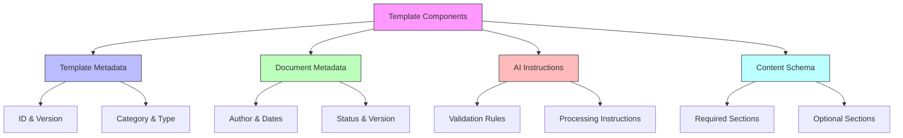

AI-friendly specification templates have a structured format that helps both humans and AI assistants to work collaboratively. Understanding the components of these templates is essential for effectively creating and maintaining them.

**Main Components of a Template:**

1. **Template Metadata**
   - Provides basic information about the template itself
   - Typically includes fields like `id`, `version`, `category`, `type`

2. **Document Metadata**
   - Contains metadata for the document generated from the template
   - Includes information such as `author`, `creation date`, `version`, `status`

3. **AI Instructions**
   - Guidance for AI assistants on how to process the template
   - May include `documentType`, `validationRules`, `promptTemplates`, `relationships`

4. **Content Schema**
   - Defines the structure and required sections of the document
   - Specifies which sections are required or optional

5. **Placeholders**
   - Markers within the template where specific content should be inserted
   - Use a specific syntax (e.g., `${PLACEHOLDER_NAME}`) and may include instructions or default values

6. **Comments and Instructions**
   - Human-readable comments to guide users on how to use the template
   - Typically enclosed in comments or special syntax and not intended to be part of the final document

### 3.4 Template Selection and Usage

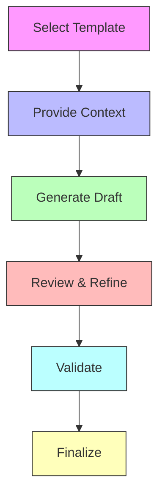

Effective template selection and usage are crucial for generating accurate and comprehensive specifications. Choose from our collection of **AI-friendly specification templates** based on what you need to document:

#### Available Templates

We offer a range of AI-friendly templates categorized into **Requirements**, **Design**, and **Implementation**:

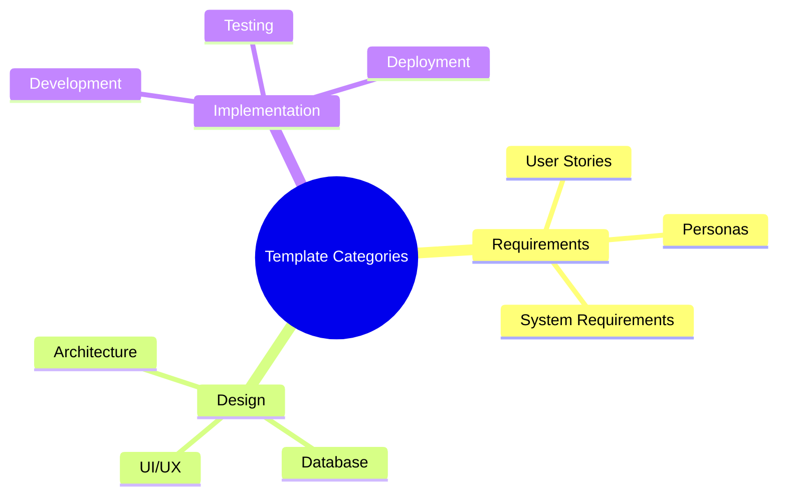

#### Template to Specification Workflow

1. **Select and Copy the Template**
   - Choose the appropriate template from the categories above
   - Copy the selected template into your `specifications/` directory
   - Rename the file appropriately (e.g., `user-story-login.mdx`)

2. **Provide Context and Requirements**
   - Determine the specific details you want to include in your specification
   - Prepare any relevant information or data that the AI assistant will need

3. **Generate Initial Draft with AI Assistant**
   - Engage with the AI assistant, providing the template and context
   - AI generates the first draft based on the template structure
   - Review the AI-generated content for accuracy and completeness

4. **Refine and Validate**
   - Fill in any missing information
   - Validate the document against template requirements
   - Incorporate stakeholder feedback as necessary
   - Update the document status to "Approved" once finalized

### 3.5 Working with AI Tools

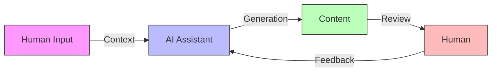

#### Collaborating with AI Assistants

Maximize the benefits of AI assistance by following these guidelines:

- **Provide Clear Context**
  - Clearly state your requirements and any constraints
  - Reference the specific template you are using

- **Iterative Refinement**
  - Work with the AI assistant in multiple iterations to enhance content quality
  - Ask targeted questions to obtain precise information

- **Validation and Consistency**
  - Use AI to check the completeness and consistency of your specifications
  - Ensure all placeholders are appropriately filled

#### Utilizing AI-Powered Editors (e.g., Cursor)

AI-powered editors like Cursor can streamline your documentation process:

- **Real-Time Assistance**
  - Receive suggestions and validations as you type
  - Utilize editor-specific commands for efficient interactions (e.g., `/generate`, `/validate`)

- **Configuration with `.cursorrules`**
  - Ensure the `.cursorrules` file is present in your project for optimal AI support
  - Customize AI processing rules as needed to align with your project requirements

## 4. Roles and Best Practices

### 4.1 Roles and Responsibilities

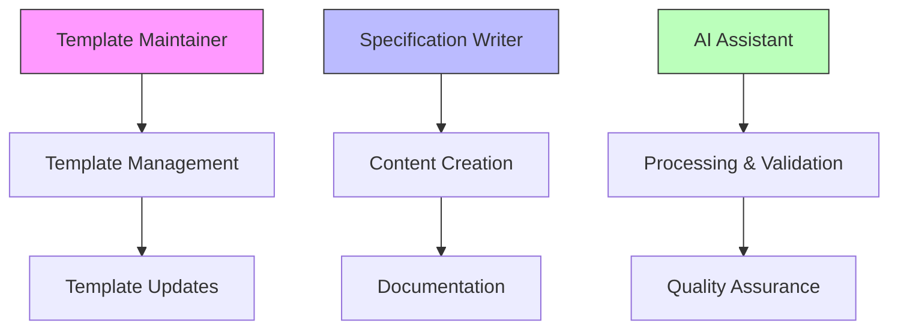

Define clear roles to streamline the specification creation process:

- **Template Maintainer**
  - **Responsibilities:**
    - Create and maintain templates
    - Update templates based on evolving project needs
    - Ensure templates adhere to best practices and standards
  - **Collaboration:**
    - Work with the AI assistant to suggest template enhancements
    - Validate templates using AI tools

- **Specification Writer**
  - **Responsibilities:**
    - Provide clear context and requirements to the AI assistant
    - Review and verify AI-generated content for accuracy
    - Coordinate stakeholder reviews and incorporate feedback
  - **Collaboration:**
    - Engage with team members to gather necessary information
    - Utilize AI tools to refine and validate specifications

- **AI Assistant**
  - **Responsibilities:**
    - Generate initial drafts based on templates and provided context
    - Validate specifications against defined rules
    - Suggest improvements and highlight missing information
  - **Collaboration:**
    - Assist in maintaining document status and changelogs
    - Support template maintainers in enhancing template structures

### 4.2 Best Practices


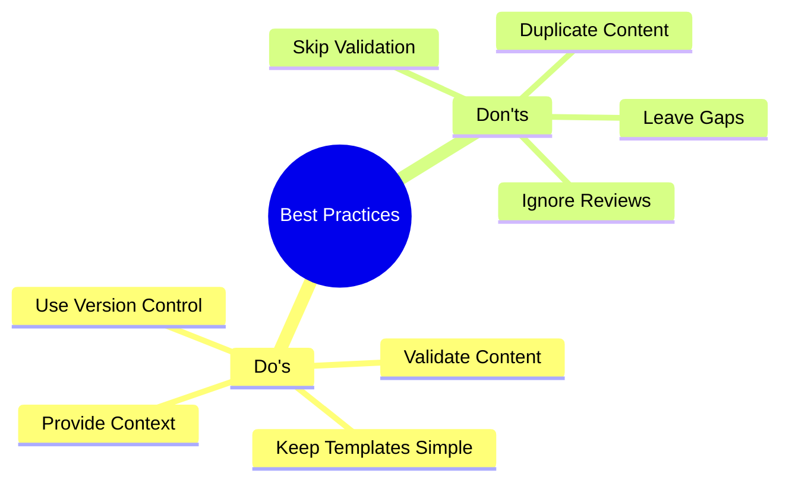

Adhering to best practices ensures the effectiveness and reliability of your specifications:

**DO:**
- **Provide Thorough Context to AI**
  - Supply comprehensive information to the AI assistant to generate accurate content

- **Review AI-Generated Content Carefully**
  - Validate the correctness and relevance of the generated specifications
  - Ensure all placeholders are appropriately filled

- **Use Version Control**
  - Implement versioning for both templates and specifications to track changes
  - Maintain a clear changelog documenting all updates

- **Keep Templates Simple and Focused**
  - Avoid unnecessary complexity in templates to facilitate easier usage and maintenance
  - Ensure templates are targeted to specific documentation needs

**DON'T:**
- **Skip Validation Steps**
  - Always validate specifications to ensure they meet project requirements and standards

- **Leave Placeholders Unfilled**
  - Ensure all placeholders in templates are appropriately replaced with relevant information

- **Rely Solely on AI Without Review**
  - Combine AI assistance with human oversight to maintain high-quality documentation

- **Duplicate Information Across Sections**
  - Avoid repeating the same information in multiple sections to enhance clarity and conciseness

## 5. Template Customization and Maintenance

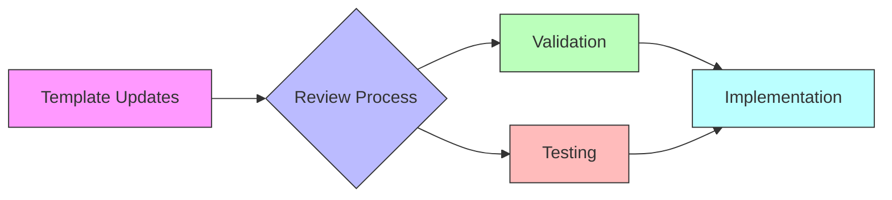

### 5.1 Editing and Extending Templates

#### Adding New Fields to Templates

To add new fields or sections in an AI-friendly and effective way:

**1. Update the Content Schema**
```yaml
contentSchema:
  sections:
    - id: "security_requirements"
      required: true
      validation: "Must include data encryption and authentication details."
```

**2. Adjust AI Instructions**
```yaml
ai:
  validationRules:
    requiredSections: ["basic_information", "goals_and_needs", "security_requirements"]
```

**3. Add Placeholders in the Template Content**
```markdown
## Security Requirements
- Data Encryption: ${DATA_ENCRYPTION_DETAILS}
- Authentication Methods: ${AUTHENTICATION_METHODS}
```

### 5.2 Enhanced Templates with Visuals

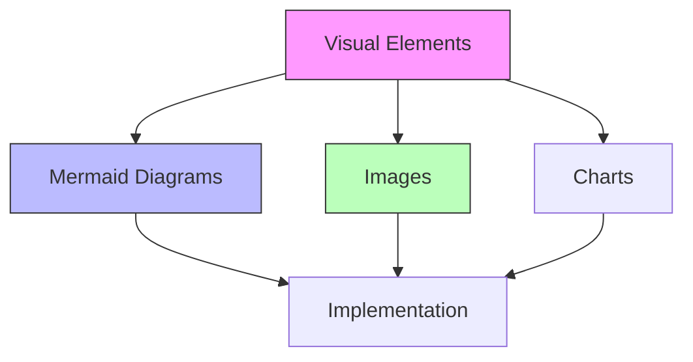

#### 5.2.1 Mermaid Diagrams
```markdown
## Architecture Diagram
${MERMAID:TYPE=flowchart}
```

#### 5.2.2 Images
```markdown
## User Interface Mockup

```

### 5.3 Template Evolution and Change Tracking

#### 5.3.1 Updating Templates
1. **Version Control**
   - Use semantic versioning (e.g., `version: "2.1.0"`)
   - Record updates in a changelog within the template

2. **Enhancing AI Instructions**
   - Define validation rules to ensure template integrity
   - Update AI instructions to improve assistance quality

3. **Refining Placeholders**
   - Adjust placeholders based on project needs
   - Introduce advanced placeholders for complex content

#### 5.3.2 Change Tracking Example
```markdown
### Template Changelog
- **v2.3.0** - *2024-04-05*
  - Added "Performance Metrics" section
  - Updated AI instructions for new validation rules

- **v2.2.0** - *2024-03-30*
  - Added "Security Requirements" section
  - Updated validation rules to include the new section
```

## 6. Reference Materials

### 6.1 Placeholder Glossary

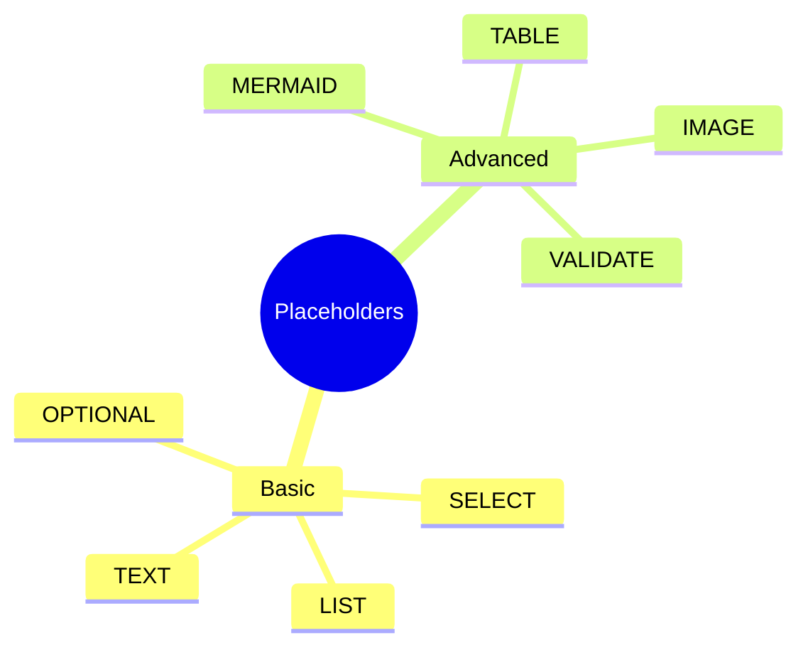

**Basic Placeholders**
- `${TEXT}`: Basic text input
- `${SELECT:Option1|Option2}`: Choose from options
- `${LIST:Items}`: Provide multiple items
- `${OPTIONAL:Field}`: Optional content

**Advanced Placeholders**
- `${MERMAID:Type}`: For diagrams (flowchart, sequence, gantt)
- `${IMAGE:Description}` and `${IMAGE:URL}`: For adding images
- `${TABLE:Headers}`: For creating tables dynamically
- `${VALIDATE:Email}`: Input with validation
- `${GENERATE:Summary}`: AI-generated content

### 6.2 List of Templates

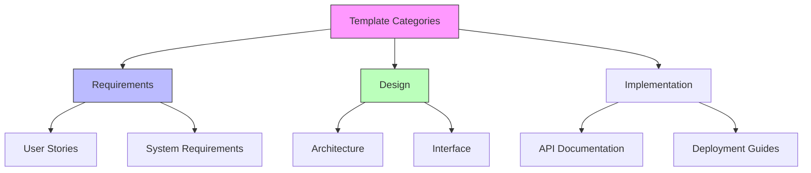

Available templates include:
- **Requirements Templates**
  - `user-persona-template.mdx`
  - `user-story-template.mdx`
  - `system-requirements-template.mdx`

- **Design Templates**
  - `architecture-diagram-template.mdx`
  - `interface-specification-template.mdx`
  - `data-model-template.mdx`

- **Implementation Templates**
  - `api-documentation-template.mdx`
  - `test-plan-template.mdx`
  - `deployment-guide-template.mdx`

## 7. Support Documents

### 7.1 Purpose of Support Documents

Support documents serve as the backbone for generating precise and relevant specifications. They include:
- **Online Documentation:** Links to APIs, frameworks, or libraries
- **Design References:** Sample designs, wireframes, or style guides
- **Assets:** Images, logos, or other media
- **Guidelines:** Specific standards and practices

### 7.2 Structure and Location

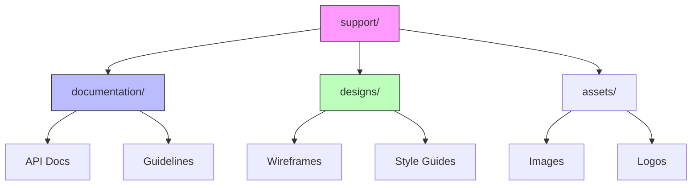

### 7.3 Naming Conventions

Maintain clear and consistent naming conventions:
- **Documentation Files:** Use descriptive names (e.g., `api-overview.md`)
- **Design Files:** Include context (e.g., `login-page-wireframe.png`)
- **Asset Files:** Use standardized prefixes (e.g., `logo-main.svg`)

### 7.4 Integration with Templates

Ensure efficient template-document integration:
- **Relative Paths:** Use relative paths for document references
- **Dynamic Inference:** Enable AI analysis of design files when supported
- **Version Alignment:** Maintain consistency between templates and support documents

### 7.5 Updating Support Documents

- **Version Control:** Track changes systematically
- **Consistency Checks:** Verify alignment with current templates
- **Feedback Integration:** Incorporate team feedback for improvements

### 7.6 Benefits of Organized Support Documents

- **Enhanced Accuracy:** Provides reliable references
- **Consistency:** Ensures uniform standards
- **Efficiency:** Streamlines document generation
- **Scalability:** Facilitates project growth

---

For more detailed information about specific templates or advanced usage, please refer to the individual template documentation in the `templates/` directory.